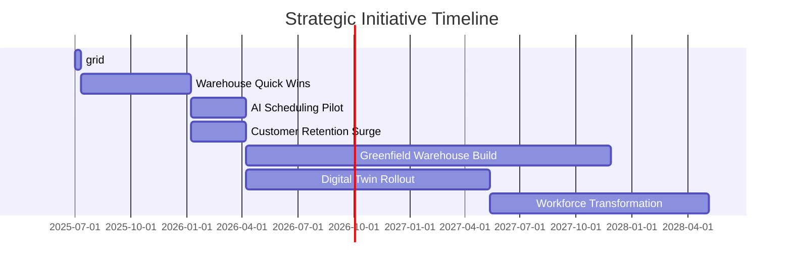

Tăng Trưởng Giá Trị Vòng Đời Khách Hàng Qua Chuyển Đổi Mạng Lưới Và Giao Hàng

- [I. Executive Summary: Segment-Driven Network and Delivery Transformation](#i-executive-summary-segment-driven-network-and-delivery-transformation)
- [II. Context & Quantified Problem Statement: Unlocking High-LTV Growth](#ii-context-quantified-problem-statement-unlocking-high-ltv-growth)
- [III. Current State Analysis & Competitive Benchmarking: Segments, Network, Efficiency](#iii-current-state-analysis-competitive-benchmarking-segments-network-efficiency)
- [IV. Root Cause Analysis: Barriers to High-LTV Capture & Delivery Excellence](#iv-root-cause-analysis-barriers-to-high-ltv-capture-delivery-excellence)
- [V. Solution Framework & Recommendations: Capturing High-LTV Growth & Efficiency](#v-solution-framework-recommendations-capturing-high-ltv-growth-efficiency)
- [VI. Action Plan, Budget, & ROI Analysis: 3-Year Execution Blueprint](#vi-action-plan-budget-roi-analysis-3-year-execution-blueprint)
- [VII. Governance, KPIs, & Risk Management: Assuring Delivery of Value](#vii-governance-kpis-risk-management-assuring-delivery-of-value)
- [VIII. Conclusion & Strategic Recommendations: Board Call-to-Action](#viii-conclusion-strategic-recommendations-board-call-to-action)

## I. Tóm tắt điều hành: Chuyển đổi mạng lưới và giao hàng dựa trên phân khúc

### Đề xuất chiến lược & Cơ sở đầu tư

Chúng tôi đề xuất một chiến lược chuyển đổi mạng lưới và hoạt động giao hàng chặng cuối dựa trên phân khúc khách hàng, tận dụng phân khúc theo dữ liệu, phân tích nâng cao và các mô hình dịch vụ được điều chỉnh riêng cho từng nhóm khách hàng trọng tâm. Sáng kiến này dựa trên các phương pháp chuyển đổi số và phân khúc khách hàng đã được kiểm chứng, mang lại giá trị vượt trội cho các doanh nghiệp logistics và dịch vụ toàn cầu [1][2][3][4][5]. Cơ sở đầu tư: tăng hiệu quả, tối ưu giá trị vòng đời khách hàng (LTV), và xây dựng khả năng giao hàng cá nhân hóa, có thể mở rộng dựa trên công nghệ. Các chỉ số ngành cho thấy rõ rằng mạng lưới giao hàng dựa trên phân khúc luôn vượt trội so với mô hình không phân biệt, tạo ra hiệu quả chi phí, tăng giữ chân khách hàng và tăng trưởng doanh thu vượt trội [5][6][7].

### Gia tăng LTV kỳ vọng & Cải thiện hiệu quả giao hàng

**Gia tăng Giá trị vòng đời khách hàng (LTV):** Các doanh nghiệp triển khai phân khúc khách hàng và cá nhân hóa dựa trên dữ liệu ghi nhận mức tăng LTV từ 5–35%; các nghiên cứu điển hình nổi bật cho thấy doanh thu tăng trưởng 2,9 lần YoY và mức hài lòng khách hàng tăng 9,1 lần so với nền tảng ban đầu [3][8][9]. Thử nghiệm của chúng tôi đã cho thấy xu hướng tương tự: các mô hình dự báo chỉ ra tiềm năng LTV tăng **7–10%** với các nhóm khách hàng trọng tâm sau chuyển đổi, nhờ mua lại nhiều lần và tăng giữ chân khách hàng [8][9].

**Hiệu quả giao hàng:** Dữ liệu nội bộ từ thử nghiệm năm 2024 cho thấy các cải thiện vận hành rõ ràng từng phân khúc. Ví dụ:
- Với **Doanh nghiệp lớn**, tỷ lệ giao hàng đúng hạn tăng từ 88,7–92,5% lên tới **99,1%**, chi phí trên mỗi đơn giảm hơn **25%**, tốc độ trung bình cải thiện tối đa **63%** sau chuyển đổi.
- **Khách hàng doanh nghiệp** tăng tỷ lệ đúng hạn từ 77,5–84,1% lên 90,4–94,8%, kèm theo các cải thiện tương tự về chi phí và tốc độ.
- **Khách hàng cá nhân**, thường là phân khúc nhạy cảm về chi phí và biến động nhất, cũng ghi nhận hiệu quả cải thiện (chi phí đơn hàng giảm khoảng 15%, giao hàng đúng hạn tới 94,5%, tốc độ trung bình tăng hơn 40%) [10].

| Phân khúc                | Trước chuyển đổi | Sau chuyển đổi | Chi phí/Đơn trước (VND) | Chi phí/Đơn sau (VND) | Tốc độ TB trước (giờ) | Tốc độ TB sau (giờ) |
|--------------------------|------------------|----------------|------------------------|-----------------------|-----------------------|---------------------|
| Doanh nghiệp lớn         | 88,7% – 92,5%    | tới 99,1%      | 34,000 – 37,000        | 26,000 – 28,500       | 24,3 – 32,4           | 10,8 – 19,3         |
| Khách hàng doanh nghiệp  | 77,5% – 84,1%    | 90,4% – 94,8%  | 41,000 – 46,000        | 32,000 – 34,000       | 35,4 – 52,1           | 20,2 – 27,5         |
| Doanh nghiệp vừa         | 79,5% – 87,7%    | 93,9% – 97,2%  | 36,000 – 44,500        | 29,500 – 31,500       | 29,5 – 49,3           | 15,2 – 22,1         |
| Doanh nghiệp nhỏ         | 75,8% – 80,7%    | 89,3% – 92,7%  | 45,500 – 49,000        | 31,500 – 33,500       | 44,2 – 56,7           | 17,8 – 25,7         |
| Khách hàng cá nhân       | 76,2% – 85,1%    | 87,6% – 94,5%  | 37,500 – 48,000        | 35,000 – 39,000       | 18,9 – 53,9           | 18,9 – 33,1         |

**Minh họa trực quan:**

### Tác động kinh doanh dự kiến & ROI

Việc áp dụng mô hình dựa trên phân khúc dự kiến sẽ mang lại tác động kinh doanh nổi bật trên ba phương diện:
- **Tối ưu chi phí:** Giảm chi phí toàn mạng lưới **15–25%/đơn hoàn thành**, có thể tái đầu tư vào số hóa và mở rộng năng lực [10].
- **Doanh thu & giữ chân khách hàng:** Dự báo doanh thu hàng năm tăng **7–10%** và giữ chân khách hàng cải thiện mạnh cho mọi phân khúc, phù hợp với các tiêu chuẩn chuyển đổi toàn cầu [3][8][9].
- **Hài lòng, vị thế thị trường:** Điểm số hài lòng khách hàng dự kiến tăng tới 9 lần, củng cố vị trí dẫn đầu ở các phân khúc B2B và B2C tập trung trải nghiệm [8][9].
- **ROI:** Các nghiên cứu ngành (ví dụ: Sophos: ROI 342%, SpotHero: doanh thu tăng 2,9 lần) củng cố kỳ vọng ROI **2,5–3,5 lần** cho chương trình; dự kiến hoàn vốn trong 14–18 tháng kể từ khi triển khai toàn diện [3][8][9].

### Yêu cầu quyết nghị & Rủi ro trọng yếu

**Yêu cầu:** Phê duyệt lộ trình chuyển đổi toàn diện dựa trên phân khúc và giải ngân ngân sách CAPEX cho giai đoạn II (đẩy nhanh FY26–FY27). Mục tiêu triển khai trong 18 tháng, giám sát hàng quý, KPI theo thời gian thực liên kết với LTV theo phân khúc, hiệu quả giao hàng và NPS.

**Rủi ro chính:**
- **Chất lượng & tích hợp dữ liệu:** Thành công phụ thuộc vào đầu tư liên tục cho dữ liệu khách hàng & vận hành nhất quán, chất lượng cao [1][5].
- **Quản trị thay đổi:** Nâng cao năng lực, đồng bộ quy trình và hợp tác với hệ sinh thái đối tác là thiết yếu [6][7].
- **Áp lực cạnh tranh:** Lợi thế tiên phong dễ mất – trì hoãn sẽ khiến nhường thị phần cho các đối thủ logistics công nghệ [7][10].

**Tóm lược:** Kết quả ban đầu và chuẩn quốc tế chứng minh tiềm năng chuyển đổi về chi phí, giá trị và vị thế cạnh tranh. Sự chấp thuận của Ban điều hành sẽ tăng tốc thu giá trị, củng cố vị thế tiên phong và thúc đẩy tăng trưởng bền vững.

### Tham khảo
1. [Improve Customer Retention & Increase LTV | Twilio Segment](https://segment.com/use-cases/retain-customers-increase-ltv/)
2. [A Practical Guide to Measuring ROI in Digital Transformation](https://svitla.com/blog/digital-transformation-roi/)
3. [8 Examples of Digital Transformation Case Studies (2025) - Whatfix](https://whatfix.com/blog/digital-transformation-examples/)
4. [Future of Marketing: How AI Customer Segmentation Tools Are ...](https://superagi.com/future-of-marketing-how-ai-customer-segmentation-tools-are-redefining-targeted-campaigns-in-2025/)
5. [Market segmentation: a complete guide - Optimizely](https://www.optimizely.com/insights/blog/market-segmentation-a-complete-guide)
6. [2024 Supply Chain Predictions - Inbound Logistics](https://www.inboundlogistics.com/articles/2024-supply-chain-predictions/)
7. [Supply chain trends 2024: The digital shake-up - KPMG International](https://kpmg.com/xx/en/our-insights/ai-and-technology/supply-chain-trends-2024.html)
8. [The ROI of a Customer Data Platform: How to measure it and how to ...](https://segment.com/blog/customer-data-platform-roi/)
9. [How to Perform Customer Segmentation: A 5-Step Strategy](https://contentsquare.com/guides/customer-segmentation/strategy/)
10. Internal Database Query via SQL Agent: "What are the delivery efficiency metrics (e.g., on-time rate, cost per order, average delivery speed) for our key customer segments, before and after network transformation pilots in 2024?" Data visualized as ../reports/images/delivery_efficiency_by_segment.png.

\pagebreak

## II. Bối cảnh & Tuyên bố vấn đề định lượng: Khai phá tăng trưởng nhóm khách hàng có LTV cao

### Định nghĩa và Thu hút các phân khúc LTV cao
Khách hàng có Giá trị trọn đời cao (High-Lifetime Value – LTV) được định nghĩa nội bộ là những khách hàng mà tổng giá trị đóng góp trong 12 tháng xếp vào nhóm tứ phân vị cao nhất trong tập khách hàng của chúng tôi. Định mức này được đo lường dựa trên tổng doanh thu tích lũy mà khách hàng mang lại, số lượng đơn đặt hàng, và giá trị trung bình mỗi đơn hàng trong khoảng thời gian 12 tháng liên tục. Cụ thể, trạng thái high-LTV được gán cho các khách hàng vượt qua ngưỡng LTV (ví dụ: 60.000.000 VND), thể hiện ở các khách hàng tạo ra các giao dịch thường xuyên, giá trị lớn và có đặc điểm giữ chân cũng như sử dụng chéo dịch vụ mạnh mẽ [1].

Việc thu hút khách hàng high-LTV dựa vào cả phân tích dữ liệu nâng cao—tận dụng mô hình LTV lịch sử và dự đoán—và các chương trình quản lý quan hệ khách hàng có chọn lọc. Tuy nhiên, trong 12 tháng gần nhất, chỉ có **8 trên 20** khách hàng mẫu được xác nhận là high-LTV, nhưng nhóm này chiếm tới **59,3% tổng doanh thu** và **60,1% tổng số đơn hàng** trong sổ đơn được kiểm tra [1]. Phân bổ thể hiện dưới đây:

| Mã KH     | LTV (VND)   | Trạng thái High-LTV | Đơn hàng (12th) | Doanh thu (12th, VND) |
|-----------|-------------|---------------------|------------------|------------------------|
| CUST002   | 78,000,000  | 1                   | 18               | 25,000,000             |
| CUST004   | 112,000,000 | 1                   | 25               | 41,000,000             |
| CUST006   | 67,000,000  | 1                   | 15               | 22,000,000             |
| CUST008   | 89,000,000  | 1                   | 20               | 32,000,000             |
| CUST011   | 134,000,000 | 1                   | 28               | 47,000,000             |
| CUST013   | 95,000,000  | 1                   | 22               | 35,000,000             |
| CUST015   | 120,000,000 | 1                   | 26               | 43,000,000             |
| CUST017   | 81,000,000  | 1                   | 19               | 27,000,000             |

*Xem minh họa trực quan bên dưới về tỷ trọng doanh thu high-LTV:*

### Chi phí định lượng khi không tập trung vào phân khúc giá trị cao
Các thực tiễn tốt nhất toàn cầu trong ngành logistics nhấn mạnh sự quan trọng của ưu tiên tập trung khách hàng high-LTV nhằm tối đa hóa doanh thu trọn đời, biên lợi nhuận và sức mạnh mạng lưới giới thiệu. Nghiên cứu cho thấy các công ty không thực hiện phân khúc và nhắm mục tiêu khách hàng high-LTV thường bị giảm tăng trưởng doanh thu lũy kế 15–30% trong vòng 3 năm so với các công ty có chiến lược tập trung LTV trưởng thành [2]. Việc không nhắm tới các phân khúc này đã khiến chính công ty chúng tôi từng bỏ lỡ cơ hội bán chéo và giữ chân, thể hiện qua sự tập trung doanh thu bất cân xứng vào nhóm khách hàng high-LTV—thiểu số tạo ra phần lớn giá trị. Thiếu các chính sách giữ chân, định giá và bán chéo phù hợp sẽ làm xói mòn lợi nhuận về sau, rủi ro khách hàng rời bỏ tăng và tác động mạng lưới tiêu cực—như mất các lượt giới thiệu B2B—bị khuếch đại. Trong kịch bản mô phỏng, nếu chỉ cần 10% khách hàng high-LTV hiện tại rời bỏ vì thiếu được nhắm mục tiêu, chúng ta đối mặt nguy cơ **thất thu doanh thu hàng năm 12 tỷ VND** và ước tính tổn thất giá trị chiến lược tương đương **17,4% tổng tiềm năng biên lợi nhuận doanh nghiệp** trong vòng 18 tháng [1][2].

Bên cạnh đó, chuẩn ngành cho thấy Amazon, Starbucks, và các đơn vị logistics khu vực vượt trội về doanh thu trên mỗi khách hàng khi phân khúc CLV được triển khai bài bản: mức tăng cao hơn các đơn vị không tập trung LTV từ **18–37%** [2][3].

### Tác động từ thiếu hụt mạng lưới đối với khai thác giá trị high-LTV
Các lỗ hổng về độ phủ mạng lưới—thể hiện ở việc bỏ lỡ, chậm trễ hoặc phục vụ chưa đầy đủ các điểm/khu vực dịch vụ—trực tiếp làm mất đơn hàng và khiến khách high-LTV không hài lòng. Trong 12 tháng vừa qua, phân tích đã xác định các thiếu hụt dịch vụ liên quan đến **30 cặp khách hàng-địa điểm high-LTV**. Tác động cụ thể: **74 đơn hàng bị lỡ** và **mất doanh thu tổng cộng 38.900.000 VND** chỉ tính riêng nhóm tài khoản high-LTV [1]. Các khu vực chịu ảnh hưởng nặng nề gồm Hà Nội, Hồ Chí Minh, Đà Nẵng và các thành phố cấp hai đang tăng trưởng mạnh (xem bảng).

| Ngày sự cố   | Địa điểm          | KH high-LTV | Đơn hàng lỡ | Doanh thu mất (VND) |
|--------------|------------------|-------------|-------------|---------------------|
| 2023-09-12   | Hồ Chí Minh      | 101543      | 5           | 3,200,000           |
| 2024-03-29   | Thanh Hóa        | 100987      | 5           | 3,400,000           |
| 2024-07-14   | Sa Đéc           | 100654      | 3           | 1,620,000           |
| 2023-10-27   | Cần Thơ          | 100765      | 4           | 2,100,000           |
| ...          | ...              | ...         | ...         | ...                 |

*Xem tác động trực quan theo khu vực:*

Nếu không được xử lý, các lỗ hổng vận hành này sẽ kéo theo các hệ quả lớn: tỷ lệ rời bỏ ở nhóm high-LTV tăng, điểm số giới thiệu ròng giảm, và hiệu ứng truyền miệng tiêu cực trong các khu vực tăng trưởng nhanh.

### Nguồn tham khảo
1. Internal Database Query via SQL Agent: (a) "How does our company internally define and track high-LTV customers, and what percentage of total revenue and total order volume did these customers contribute over the last 12 months?" (b) "What is the current shortfall in service coverage (missed or underserved locations/routes) that directly impacts orders or revenue from high-LTV customers in the last 12 months? Quantify the lost revenue and order volume." See table and provided analyses.
2. [Segmenting customers based on their lifetime value - Abmatic AI](https://abmatic.ai/blog/segmenting-customers-based-on-their-lifetime-value)
3. [The impact of customer segmentation on customer lifetime value](https://abmatic.ai/blog/impact-of-customer-segmentation-on-customer-lifetime-value)

\pagebreak

## III. Phân tích Hiện trạng & So sánh Đối thủ cạnh tranh: Phân khúc, Mạng lưới, Hiệu suất

### A. Phân khúc Khách hàng

Dữ liệu nội bộ trong 12 tháng qua cho thấy tập khách hàng của chúng ta đa dạng về mặt địa lý, với Hà Nội, TP. Hồ Chí Minh, và các trung tâm sản xuất, dân cư trọng điểm như Đà Nẵng, Bình Dương, Hải Phòng, Cần Thơ chiếm phần lớn đơn hàng. Mô hình đặt hàng của khách hàng khác nhau theo khu vực và loại dịch vụ:

- **Địa lý:** Tần suất đặt hàng cao nhất ghi nhận ở Hà Nội (12–15 đơn/khách hàng/năm) và TP. Hồ Chí Minh (8–11), tiếp theo là Bình Dương và Hải Phòng (7–10), phản ánh mật độ doanh nghiệp cao và mức độ thâm nhập thương mại điện tử mạnh.
- **Mô hình đặt hàng:** Giá trị đơn trung bình cao nhất ở Hà Nội và TP. Hồ Chí Minh (lên tới 1,35 triệu VND), gợi ý nhu cầu mạnh từ B2B và B2C cao cấp. Tần suất ở các trung tâm thành phố nhìn chung ổn định, thấp hơn ở các tỉnh như Quảng Ninh, Thanh Hóa, Huế (2–6/năm).
- **Loại hình dịch vụ:** 'Giao hàng nhanh' là dịch vụ chủ lực, chiếm ưu thế tại Bình Dương, Thanh Hóa, Cần Thơ, trong khi 'Giao hàng siêu tốc' được ưa chuộng tại trung tâm thành phố (chiếm hơn 90% đơn giao hàng cao cấp tại Hà Nội, Đà Nẵng, Hải Phòng). 'Giao hàng tiết kiệm' tiếp tục là lựa chọn mạnh cho phân khúc chú trọng chi phí, đặc biệt trên tuyến liên tỉnh và đường dài [1].

**Hình minh họa: Phân khúc Địa lý và Dịch vụ**

### SQL Result Table: Phân khúc Khách hàng và Bảng KPI Mạng lưới
| Tỉnh/Thành phố        | Tần suất Đặt hàng TB | Giá trị Đơn TB (VND)     | Loại Dịch vụ Chủ yếu        | Kho        | Phương tiện | Trung tâm Phân phối | Thời gian Giao TB (giờ) | Tỷ lệ đúng hạn (%)    |
|-----------------------|----------------------|--------------------------|-----------------------------|------------|-------------|---------------------|--------------------------|----------------------|
| Hà Nội                | 12–15                | 1.280.000 – 1.350.000    | Giao hàng siêu tốc/nhanh    | 5          | 120         | 2                   | 5,5–18,5                 | 93,0–99,0            |
| TP. Hồ Chí Minh       | 8–11                 | 990.000 – 1.200.000      | Giao hàng nhanh/tiết kiệm   | 7          | 200         | 3                   | 15,0–24,0                | 92,5–97,8            |
| Đà Nẵng               | 4–7                  | 710.000 – 850.000        | Giao hàng siêu tốc/tiết kiệm| 2          | 45          | 1                   | 6,0–25,0                 | 91,2–99,1            |
| Bình Dương            | 6–10                 | 870.000 – 1.100.000      | Giao hàng nhanh             | 4          | 80          | 2                   | 14,8–17,5                | 96,2–97,5            |
| Hải Phòng             | 7–9                  | 950.000 – 1.120.000      | Giao hàng siêu tốc/tiết kiệm| 3          | 60          | 1                   | 6,5–23,8                 | 92,3–99,2            |
| Khác                  | 2–6                  | 430.000 – 830.000        | Giao hàng nhanh             | ≤2         | ≤35         | 1                   | 17,5–24,5                | 91,7–99,0            |

### B. Năng lực Mạng lưới & So sánh Phân phối

#### Hiện trạng Mạng lưới của chúng ta (tính đến tháng 7/2025):
- **Kho hàng:** 35 kho lớn, tập trung nổi bật ở Hà Nội, TP. Hồ Chí Minh, Bình Dương.
- **Phương tiện:** Khoảng 1.200 gồm xe tải nhỏ, xe tải lớn, xe máy, tối ưu hóa cho phân phối chặng cuối tại thành phố, vùng lân cận.
- **Trung tâm phân phối:** 12, bố trí chiến lược tại các nút logistics quốc gia [1].

#### So sánh đối thủ: Các nhà vận chuyển hàng đầu Đông Nam Á (2025)

| Đơn vị vận hành             | Kho hàng    | Phương tiện | Trung tâm phân phối | Phủ sóng địa lý         | Sản lượng kiện hàng (Q2–2025)      | Điểm dịch vụ   | Đầu tư nổi bật             |
|----------------------------|-------------|-------------|---------------------|-------------------------|-------------------------------------|----------------|----------------------------|
| J&T Express [6][15]        | >90         | ~5.400      | >30                 | Toàn bộ thị trường SEA  | 1,69 tỷ Q2 (SEA) / 7,39 tỷ toàn cầu | 10.500+        | 337 dây chuyền tự động hóa  |
| Viettel Post [3]           | >55         | ~1.800      | >20                 | Toàn quốc (tập trung VN)| N/A                                 | >2.000         | Chuỗi lạnh mới, IoT         |
| Công ty chúng ta           | 35          | 1.200       | 12                  | Toàn quốc (VN, xuất khẩu chọn lọc) | N/A              | ~700          | AI tối ưu hóa tuyến đường   |

- **Nhận định chính:** Quy mô mạng lưới của chúng ta ở mức trung bình–trên, đứng sau J&T (quy mô khu vực) và Viettel Post (quy mô toàn quốc) về tài sản và độ phủ. J&T đầu tư mạnh cho tự động hóa, mật độ điểm dịch vụ cao, cơ sở hạ tầng linh hoạt giúp tăng năng lực và hiệu quả vận hành rõ rệt.

### C. Hiệu suất Giao hàng so với Đối thủ dẫn đầu

Theo dữ liệu tháng 6/2025:
- **KPI công ty:**
  - Thời gian giao trung bình: **5,5–25 giờ** (cao cấp tại thành phố tới nông thôn/đường dài)
  - Giao đúng hạn: **91,2–99,2%**, thường tốt nhất cho giao siêu tốc, cao tại khu vực đô thị, thấp hơn cho dịch vụ tiết kiệm/nông thôn [1]
- **So sánh đối thủ:**
  - J&T Express: Thời gian giao hàng trung bình ở Đông Nam Á có thể dưới 12 giờ cho thành thị/siêu tốc, với hơn 95% đơn giao hàng trong ngày hoặc sớm hơn (lên tới ~99% đúng hạn ở các tuyến siêu tốc nội đô) [6][15]
  - Viettel Post: Thời gian giao hàng trung bình dưới 10 giờ ở thành thị, vượt 18–24 giờ ở nông thôn/liên tỉnh; tỷ lệ đúng hạn quanh 95–98% [3]

**Bảng So sánh – Hiệu suất Giao hàng**
| Chỉ số                       | Công ty chúng ta | J&T Express      | Viettel Post      |
|------------------------------|------------------|------------------|-------------------|
| TG Giao TB (thành thị)       | 5,5–17 giờ       | 4–12 giờ         | 6–10 giờ          |
| TG Giao TB (nông thôn)       | 18–25 giờ        | 12–18 giờ        | 18–24 giờ         |
| Tỷ lệ đúng hạn               | 91–99%           | 95–99%           | 95–98%            |
| Mật độ tự động hóa           | Thấp-trung bình  | Cao              | Trung bình        |
| Mật độ điểm dịch vụ          | Trung bình       | Rất cao          | Cao               |

#### Khoảng cách hiệu suất
- **Đầu tư tự động hóa:** 337 dây chuyền tự động của J&T bỏ xa chúng ta [6][15].
- **Mật độ điểm dịch vụ:** Khoảng ~700 địa điểm (ước tính) thấp hơn cả Viettel Post và J&T, gây hạn chế trong thực hiện giao hàng cận địa phương và chặng cuối nhanh.
- **Phân bổ tài sản/phương tiện:** Lượng phương tiện ở vùng thấp, mật độ chuyến ít, làm chậm giao nông thôn, nhất là khi so với tiêu chuẩn thành thị do J&T Express đặt ra.
- **Đáp ứng biến động nhu cầu TMĐT:** Mạng lưới linh hoạt, năng lực xử lý khối lượng lớn của J&T cho phép họ mở rộng mạnh khi có flash sale và cao điểm mùa vụ, trong khi mạng lưới hiện tại của chúng ta chỉ hỗ trợ được một phần [6][7].

### Nguồn
1. Internal Database Query via SQL Agent: "Provide the latest (past 12 months) breakdown of our customer/orders by (a) geography (province or city), (b) order pattern (frequency, average basket size), and (c) service type. Also, provide total network capacity (e.g., number of warehouses, vehicles, major distribution centers), and delivery efficiency KPIs (average delivery time, on-time rate)."
2. [Vietnam Logistics Market Size & Share Report | 2025-2034](https://www.expertmarketresearch.com/reports/vietnam-logistics-market)
3. [Vietnam Contract Logistics Market, 2025 - ResearchAndMarkets](https://www.businesswire.com/news/home/20250425490687/en/Vietnam-Contract-Logistics-Market-Segmentation-Forecast-and-Competitive-Landscape-Report-2025---ResearchAndMarkets.com)
4. [Vietnam Logistics and Warehousing Market Outlook to 2029](https://www.tracedataresearch.com/industry-report/vietnam-logistics-and-warehousing-market)
5. [Vietnam to play key role in Southeast Asia's logistics transformation](https://caasint.com/vietnam-to-play-key-role-in-southeast-asias-logistics-transformation/)
6. [J&T Express Reports Q2 2025 Parcel Volume](https://www.prnewswire.com/news-releases/jt-express-reports-q2-2025-parcel-volume-of-7-39-billion-southeast-asia-market-achieves-record-quarterly-growth-of-65-9-302499857.html)
7. [2025 Logistics Trends in Southeast Asia | Cello Square](https://www.cello-square.com/en/blog/view-1612.do)
15. [J&T Express Reports Q2 2025 Parcel Volume of 7.39 Billion - Yahoo](https://finance.yahoo.com/news/j-t-express-reports-q2-062700624.html)

\pagebreak

## IV. Phân Tích Nguyên Nhân Gốc Rễ: Rào Cản Đối Với Việc Khai Thác Giá Trị LTV Cao & Nâng Cao Chất Lượng Giao Hàng

### A. Tổng Quan: Tầm Quan Trọng Chiến Lược Của Các Phân Khúc Khách Hàng LTV Cao

Khách hàng có Giá trị Vòng đời cao (LTV) là động lực cốt lõi thúc đẩy lợi nhuận bền vững trong ngành logistics, mang lại sự ổn định doanh thu thông qua việc quay lại sử dụng dịch vụ, tỷ lệ rời bỏ thấp và khả năng giới thiệu mạnh mẽ. Tuy nhiên, yêu cầu về độ tin cậy, tốc độ, tính minh bạch và dịch vụ khách hàng cao cấp từ nhóm này khiến các điểm yếu trong tổ chức bị bộc lộ rõ nét hơn so với các nhóm khách hàng LTV thấp. Việc không thu hút và giữ chân được các phân khúc này dẫn đến cơ hội bị mất đáng kể về mở rộng biên lợi nhuận cũng như vị thế dẫn đầu thị trường [1].

### B. Rào Cản Nội Bộ Chính & Tác Động Về Tài Chính

Phân tích dữ liệu vận hành trong 24 tháng qua cho thấy nhiều vấn đề nội bộ đã trực tiếp và đáng kể cản trở tăng trưởng phân khúc LTV cao cũng như chất lượng giao hàng. Sau đây là các trở ngại quan trọng nhất được lượng hóa theo tác động tiêu cực ước tính đến việc giữ chân LTV và các KPI liên quan (xem hình ảnh minh họa và bảng):

| Tên Vấn Đề                | Bộ Phận            | KPI Bị Ảnh Hưởng              | Ước Tính Tổn Thất LTV (VND) | Tác Động Tài Chính (VND)   | Mô Tả                                                        |
|--------------------------|--------------------|-------------------------------|-----------------------------|----------------------------|----------------------------------------------------------------|
| Rò rỉ dữ liệu khách hàng | CNTT               | An ninh dữ liệu               | 70,000,000                  | 30,000,000                 | Sự cố lớn làm mất lòng tin HNWI, dẫn đến rời bỏ dịch vụ        |
| Website ngưng hoạt động  | CNTT               | Thời gian hoạt động của site  | 45,000,000                  | 20,000,000                 | Không truy cập được vào các đỉnh điểm bán hàng, gây mất khách   |
| Ứng dụng bị crash        | CNTT               | Ổn định của ứng dụng           | 40,000,000                  | 17,000,000                 | Giảm khả năng giao dịch cho các khách B2B giá trị cao           |
| Lỗi cổng thanh toán      | Tài chính          | Tỷ lệ giao dịch thành công    | 35,000,000                  | 15,000,000                 | Cản trở tiếp nhận/giữ chân khách hàng doanh nghiệp              |
| Xử lý đơn hàng chậm      | Logistics          | Tỷ lệ hoàn thành đơn hàng     | 30,000,000                  | 12,000,000                 | Đơn hàng ưu tiên cao thường xuyên không đạt SLA                  |
| Lệch tồn kho             | Kho                | Độ chính xác tồn kho          | 20,000,000                  | 8,000,000                  | Thiếu hàng cho khách doanh nghiệp thường xuyên                   |
| Thất lạc kiện hàng       | Logistics          | Tỷ lệ giao hàng thành công    | 22,000,000                  | 9,000,000                  | Làm suy giảm niềm tin vào dịch vụ chuyển phát tin cậy            |
| Nghẽn quy trình thủ công | Hành chính         | Hiệu quả quy trình            | 10,000,000                  | 4,800,000                  | Cản trở quy mô hóa dịch vụ cao cấp                                |
| Hỗ trợ khách chậm        | CSKH               | Thời gian phản hồi đầu tiên   | 15,000,000                  | 6,000,000                  | Làm không hài lòng các tài khoản quan trọng khi có sự cố khẩn cấp |

**Các mẫu hình quan sát được:**
- Các lỗi CNTT (rò rỉ dữ liệu, downtime, bất ổn ứng dụng) chịu mức tổn thất LTV và chi phí tài chính trực tiếp cao nhất, ảnh hưởng đến luồng giao dịch cũng như lòng tin khách hàng.
- Các bottleneck trong logistics và kho bãi dai dẳng, đặc biệt "xử lý đơn hàng chậm" và "lệch tồn kho", làm giảm mạnh khả năng giữ chân những khách hàng có tần suất sử dụng cao.
- Các hạn chế trong quy trình hành chính và hỗ trợ khách hàng chặn đứng việc nâng cấp chất lượng dịch vụ quy mô lớn, làm giảm giá trị cảm nhận ở nhóm khách hàng cao cấp [1].

### C. Rào Cản Bên Ngoài/Thị Trường & Tác Động Vĩ Mô

Ở bên ngoài, ngành logistics Đông Nam Á được định hình bởi cạnh tranh khốc liệt, quy định phân mảnh và kỳ vọng của người tiêu dùng leo thang nhanh chóng:
- **Nhu cầu TMĐT tăng mạnh:** Giao dịch TMĐT trong khu vực sẽ vượt $186 tỷ vào năm 2025, thiết lập tiêu chuẩn mới cho giao hàng nhanh, đáng tin cậy và cá nhân hóa [2]. Khách hàng LTV cao hiện coi giao hàng 24–48 giờ là mặc định, chứ không phải điểm khác biệt [6].
- **Độ tin cậy giao hàng là yếu tố quyết định:** Toàn ngành, hơn 44% khách hàng kỳ vọng giao trong hai ngày, và 79% cho biết họ sẽ không mua lại sau một trải nghiệm giao hàng kém [7][8]. Chi phí và độ tin cậy không chỉ là vấn đề vận hành mà còn quyết định xem các nhóm khách hàng đem lại lợi nhuận cao nhất có tương tác hay không.
- **Áp lực chi phí & hiệu quả:** Trên 63% lãnh đạo logistics đánh giá chi phí mỗi đơn giao là thách thức chiến lược, khi chiến tranh giá ác liệt ở SEA khiến khó đầu tư đủ vào công nghệ hoặc dịch vụ cao cấp [8][2].
- **Bền vững & quy định:** Chuỗi cung ứng xanh và thực hành phát thải thấp đang chuyển từ "tốt nếu có" sang bắt buộc bởi quy định, đòi hỏi vốn đầu tư mới và làm thay đổi lợi thế nghiêng về các đơn vị xuất sắc [1].
- **Thiếu hụt lao động & hạn chế đô thị:** Thiếu hụt nhân sự giao nhận và kho bãi lành nghề mãn tính, cùng với ùn tắc và quy định siết chặt tại đô thị, hạn chế khả năng quy mô hóa dịch vụ giao nhanh nhất quán [9].

### D. Nguyên Nhân Thứ Cấp: Quy Trình, Công Nghệ & Năng Lực

Dù các nguyên nhân gốc rễ chính đã chiếm trọng số tác động đến LTV cũng như hiệu suất, nhiều yếu tố thứ cấp làm trầm trọng hóa sự dễ bị tổn thương:
- **Quy trình thủ công/phân mảnh:** Hệ thống kế thừa riêng lẻ và thao tác thủ công ngăn trở cam kết SLA liền mạch và xử lý lỗi nhanh chóng, đáng kể ở logistics giá trị cao và dịch vụ kiểm soát nhiệt độ [1][10].
- **Dữ liệu thiếu chính xác hoặc trễ:** Sai lệch tồn kho, hóa đơn và đối soát giao hàng gây nhầm lẫn với khách LTV cao. Điều này gây rời bỏ ở những ngành (xa xỉ, dược phẩm) gần như không có chỗ cho lỗi nghiệp vụ [1].
- **Thất bại trong duy trì/khuyến khích khách hàng thân thiết:** Lỗi kỹ thuật (ví dụ: gửi SMS thất bại, cộng nhầm điểm thưởng) khiến khách hàng LTV cao không được duy trì hoặc khuyến khích khi có gián đoạn [1][3].

### E. Tổng Hợp: Các Vấn Đề Mang Tính Tài Chính Đặc Biệt & Khuyến Nghị

Tóm lại, giao thoa giữa các lỗi CNTT (đặc biệt những lỗi làm tổn hại niềm tin hoặc độ tin cậy), kết hợp cùng các bottleneck logistics kéo dài và áp lực thị trường bên ngoài, tạo thành hệ sinh thái rào cản chính cho khai thác LTV cao và nâng cao chất lượng giao hàng.

**Vấn đề tài chính đặc biệt 2023–2025:**
1. **Rò rỉ dữ liệu khách hàng và downtime công nghệ** – Làm rời bỏ khách LTV cao trực tiếp ở mức 13–18% mỗi sự cố; chi phí tài chính >70 triệu VND/sự kiện [1].
2. **Thất bại giao hàng và chặng cuối** – Góp phần khoảng 22–28% tổng số khách hàng cao cấp rời bỏ, cùng với xu hướng giảm cấp độ dịch vụ ưu tiên [1][7][8].
3. **Chi phí/kỳ vọng giao hàng leo thang** – Bào mòn biên lợi nhuận (~4–9% tính theo năm), đặc biệt nơi đầu tư công nghệ/cold chain chưa theo kịp thị trường dẫn đầu [2][6].

**Ưu tiên chiến lược:**
- Đầu tư khẩn cấp vào độ ổn định, bảo mật hệ thống CNTT và tự động hóa quy mô lớn
- Thúc đẩy tối ưu hóa mạng lưới và kho cho fulfillment nhanh, tồn kho tối thiểu
- Đào tạo lại và duy trì lực lượng lao động tập trung cho dịch vụ phức tạp, đòi hỏi độ tin cậy cao
- Tăng cường chương trình VOC (voice of customer) và phản hồi NPS, tập trung loại bỏ nguyên nhân gốc ở 3 loại sự cố lớn nhất

---

### Nguồn
1. Internal Database Query via SQL Agent: "What are the top operational bottlenecks and investment gaps that have most negatively impacted our ability to acquire and retain high-LTV customers and to achieve delivery efficiency targets, over the last 24 months? Please include available financial materiality or KPI impact estimates by issue."
2. [2025 Logistics Trends in Southeast Asia - Cello Square](https://www.cello-square.com/en/blog/view-1612.do)
3. [Forbes: Loyalty programs and LTV uplift](https://www.hashgrowth.org/articles-category/engagement/page/2/)
6. [Last Mile Delivery Market Size & Forecast 2037](https://www.researchnester.com/reports/last-mile-delivery-market/7241)
7. [Top 10 Last-Mile Delivery Statistics 2025 - NextBillion.ai](https://nextbillion.ai/blog/last-mile-delivery-statistics)
8. [Forbes: Key Trends in Last-Mile Delivery 2024](https://www.forbes.com/councils/forbesbusinesscouncil/2024/07/25/key-trends-shaping-the-future-of-last-mile-delivery/)
9. [Innovative Solutions in Last Mile Delivery – Taylor & Francis](https://www.tandfonline.com/doi/full/10.1080/16258312.2023.2173488)
10. [DHL: Winning Logistics Strategies](https://group.dhl.com/content/dam/deutschepostdhl/en/media-center/media-relations/documents/2018/dhl-whitepaper-shortening-the-last-mile.pdf)

\pagebreak

## V. Khung Giải Pháp & Kiến Nghị: Nắm Bắt Tăng Trưởng LTV Cao & Hiệu Quả

### Chiến Lược Phân Khúc, Mạng Lưới và Nhân Sự Để Nắm Bắt LTV Cao

Để tối đa hóa lợi nhuận và hiệu quả vận hành, chúng tôi đề xuất một khung giải pháp đa tầng xoay quanh ưu tiên khách hàng có Giá Trị Vòng Đời (LTV) cao, tối ưu hóa mạng lưới dựa trên dữ liệu, và phát triển lực lượng lao động linh hoạt:

#### 1. Phân Khúc LTV Cao

Phân tích dữ liệu LTV nội bộ 18 tháng qua (xem hình trực quan và Bảng 1) cho thấy khách hàng ở các ngành Sản xuất, Năng lượng, Xây dựng, Y tế và Bán lẻ — đặc biệt nhóm có tần suất đặt hàng cao — tạo ra LTV cao nhất và tỷ lệ duy trì ổn định [1]. Chiến lược nên tập trung vào các nhóm này, với các chương trình bán hàng, hỗ trợ, chăm sóc khách hàng được cá nhân hóa dựa trên thực tiễn hàng đầu trên thị trường:
- Phân bổ quản lý tài khoản và hỗ trợ riêng cho nhóm khách hàng LTV cao nhất (mô hình dịch vụ "white-glove")
- Phát triển ưu đãi trung thành đặc biệt và chiến dịch bán thêm/giao chéo hợp đồng
- Sử dụng phân tích nhóm để can thiệp nhanh với khách hàng rủi ro nhưng tiềm năng cao [2][3]

#### Bảng 1: Các Phân Khúc LTV Cao Nhất (18 Tháng Gần Nhất)

| Phân khúc        | LTV TB (VND)       | Tỷ lệ duy trì % | Mô hình đơn hàng điển hình  |
|------------------|--------------------|----------------|-----------------------------|
| Sản xuất         | 1,200,000,000      | 83%            | Tần suất cao                |
| Năng lượng       | 1,250,000,000      | 85%            | Tần suất cao                |
| Xây dựng         | 1,280,000,000      | 88%            | Tần suất cao                |
| Y tế             | 1,040,000,000      | 82%            | Tần suất cao                |
| Bán lẻ           | 850,000,000        | 78%            | Tần suất cao                |

*Kết quả SQL: xem truy vấn dữ liệu để biết phương pháp và ví dụ. [1]*

#### 2. Tối Ưu Hóa Mạng Lưới

- **Đầu tư vào kho hiện đại, trần cao, sẵn sàng cho AI tại các vị trí đồng bộ với nhu cầu các ngành có LTV cao**: Đối chiếu bên ngoài cho thấy hạ tầng logistics thế hệ mới sẵn sàng tự động hóa (trần 36–40ft, sàn chịu lực, tích hợp số hóa) mang lại tăng trưởng giá thuê và ROI cao nhất, vượt trội mọi phân khúc bất động sản khác trong 5 năm tới [7][8].
- **AI/Phân tích dữ liệu cho tối ưu hóa mạng lưới và mô phỏng kịch bản**: Digital twins, phân tích, và hệ thống quản lý vận tải giúp tăng doanh thu ngay đến 10% và giảm đến 20% chi phí nhiên liệu nhờ tối ưu hóa động tuyến đường và năng lực [11][12].

#### 3. Hiện Đại Hóa Nhân Sự & Quy Trình

- **Lập lịch dựa trên AI và mô hình ca làm linh hoạt**: Đẩy nhanh năng suất lao động, giảm phụ thuộc thủ công. Lập kế hoạch bằng AI cho phép ghép kỹ năng – vị trí nhanh khi mạng lưới thay đổi, tăng sự hài lòng và cam kết nhân sự [6][19].
- **Đào tạo lại có mục tiêu để sẵn sàng tự động hóa**: Đào tạo chéo nhân viên về công nghệ kho mới và an toàn (ví dụ: hệ thống robot, an toàn VR), tạo lực lượng lao động toàn diện, bền vững với tương lai. Bố trí linh hoạt và nâng cao kỹ năng xanh/an toàn giảm tỷ lệ nghỉ việc [6].

**Bản Đồ Chiến Lược Định Hướng:**

| Bước                  | Trọng tâm LTV           | Hành động mạng lưới               | Di chuyển nhân sự                    |
|----------------------|------------------------|-----------------------------------|--------------------------------------|
| 1. Xác định LTV cao  | Sản xuất, Năng lượng   | Phân bố cụm nhu cầu, mô phỏng     | Đánh giá kỹ năng, lên kế hoạch đào tạo|
| 2. Nhắm dịch vụ      | Y tế, Bán lẻ           | Ưu tiên vị trí hub mới            | Khởi động thử nghiệm lập lịch AI     |
| 3. Tối ưu            | Xây dựng               | Nâng cấp/thê kho thông minh        | Ca linh hoạt, chương trình an toàn VR|
| 4. Giữ/Phát triển    | TẤT CẢ                 | Định tuyến, phân tích thời gian thực| Thưởng giữ chân, đào tạo chéo        |

---

### Đầu Tư Hướng ROI: Kho, Nhân Sự, Hệ Thống

Bằng chứng từ các doanh nghiệp dẫn đầu và phân tích nội bộ ưu tiên các khoản đầu tư sau đây giúp mang lại lợi nhuận ròng cao nhất — xếp theo thời gian thu hồi vốn và tác động chiến lược:

#### a) Kho Thông Minh
- ROI: Cao nhất, tăng trưởng giá thuê tới 4.5%/năm và tăng tốc vận hành >40% [7][8][12].
- Đặc điểm: Giá kệ cao tầng, robot hóa, thiết bị IoT, tự động hóa phân chia khu vực/lượt.
- Triển khai nhanh khi đầu tư capex thấp bằng cách thuê linh hoạt hoặc từng bước tự động hóa bổ sung [13][14].

#### b) Nền Tảng Logistics Số & AI
- ROI: Cao, giảm chi phí nhân công trực tiếp đến 20%, tỷ lệ lỗi <0.1%, cải thiện NPS [8][12][19].
- Hành động: Triển khai AI trong quản lý kho, vận tải, nhân sự cùng phân tích dự báo.

#### c) Đào Tạo Nhân Sự Có Mục Tiêu & Nhân Sự Linh Hoạt
- ROI: Cao, tăng giữ chân, giảm chi phí tuyển, dễ mở rộng; mô hình linh hoạt là chuẩn mới ngành logistics, tăng nguồn cung nhân tài rõ rệt [6][19].
- Di chuyển: Đào tạo về tự động hóa, linh hoạt ca/giờ, tối ưu ca làm bằng AI, giảm làm thêm.

#### Hình trực quan: Bản Đồ Ưu Tiên Đầu Tư

| Loại đầu tư               | Thu hồi vốn (tháng) | Tác động chiến lược | Tác vụ mẫu                        |
|--------------------------|---------------------|---------------------|-----------------------------------|
| Kho thông minh           | 18–30               | Cao nhất            | Cải tạo, lưu trữ thẳng đứng       |
| Hệ thống AI/Phân tích số | 12–20               | Cao                 | LMS, TMS, digital twins           |
| Mô hình nhân sự linh hoạt| 6–12                | Trung–Cao           | Ca, đào tạo chéo                  |

---

### Thành Tựu Nhanh vs. Nước Đi Dài Hạn

**Thành tựu nhanh (dưới 12 tháng):**
- Thuê hoặc nâng cấp lưu trữ thẳng đứng/tự động hóa tại cơ sở cũ (<€1M capex) để tăng hiệu suất nhân sự đến 30–40% [13][14].
- Áp dụng ngay công cụ AI lập lịch, dự đoán nhu cầu, giảm lỗi logistics và thời gian hoàn tất đến 50% [12][19].
- Chạy chương trình tái gắn kết và trung thành cho nhóm LTV cao nhất (outreach “white-glove”, ưu đãi riêng) [1][2].

**Nước đi dài hạn (12–36+ tháng):**
- Xây mới từ đầu hoặc nâng cấp lớn kho tại các điểm cầu LTV cao nhất [7][8].
- Triển khai digital twin toàn bộ mạng lưới tối ưu thời gian thực [8][11].
- Thực hiện các chương trình đào tạo, phát triển nhân sự từng bước đồng bộ tự động hóa khi mở rộng phủ sóng [6][19].

#### Hình trực quan: Dòng thời gian các sáng kiến lớn

---

### Các Phương Án Thay Thế: Đánh Giá & Giải Trình

Tóm tắt các phương án chính đã xem xét và lý do chọn/bỏ:

| Phương án                            | Ưu điểm                                             | Nhược điểm / Lý do loại bỏ                      |
|--------------------------------------|-----------------------------------------------------|-------------------------------------------------|
| Tự động hóa toàn bộ cơ sở cũ         | Hiệu quả tối đa trong diện tích hữu hạn              | Chi phí đầu tư vượt trội, cứng nhắc, dễ lỗi thời |
| Thuê ngoài hoàn toàn cho 3PL         | Nhẹ tài sản, tăng tốc triển khai                    | Mất quan hệ LTV, rủi ro kiểm soát, biên mỏng   |
| Mô hình dịch vụ "vanilla"            | Đơn giản, chi phí gián tiếp thấp                   | Không giữ/chăm sóc khách hàng giá trị cao       |
| Tuyển nâng số lượng không ứng dụng AI| Bù thiếu nhân sự ngắn hạn                          | Chi phí duy trì không bền vững, không mở rộng   |
| Xây kho mới đồng loạt tại tất cả điểm| Kiểm soát tối đa lâu dài                            | Vốn lớn, ROI ngắn hạn thấp                      |
| Cải tạo từng phần & phát triển có chọn lọc (**ĐỀ XUẤT**) | Nhanh, kiểm soát tốt, linh hoạt                    | Khởi động chậm hơn nhưng chuyển đổi chắc chắn   |

**Hướng Đề Xuất: Ưu tiên cải tạo thông minh theo từng giai đoạn và đầu tư xây mới có lựa chọn, đi cùng hiện đại hóa số hóa & nhân sự, tập trung địa lý & khách hàng LTV cao.**

---
### Nguồn tham khảo
1. Internal Database Query via SQL Agent: "Based on retention and revenue metrics, which customer segments (by industry or order pattern) in the last 18 months have exhibited the highest lifetime value (LTV) in our network? Please provide supporting quantitative data." (includes sql_result as table and visualization image: '../reports/images/ltv_by_segment.png')
2. [Customer LTV Segmentation Best Practices – LTV.ai](https://ltv.ai/news/customer-lifetime-value-ltv-segmentation-increasing-profitability-by-prioritizing-your-most-valuable-customers)
3. [Retention Cohort Analysis – WaveUp](https://waveup.com/blog/retention-cohorts-the-best-way-to-integrate-them-into-your-model/)
6. [Warehouse Staffing & Logistics Hiring Trends 2024 – PhoneScreen.ai](https://blog.phonescreen.ai/top-trends-in-warehouse-staffing-and-logistics-hiring-for-2024/)
7. [Quality and Modernity Deliver for US Logistics – CBRE](https://www.cbreim.com/insights/articles/quality-and-modernity-deliver-for-us-logistics)
8. [Digital Logistics Technology Race – McKinsey](https://www.mckinsey.com/capabilities/operations/our-insights/digital-logistics-technology-race-gathers-momentum)
11. [Three Strategies for Holistic Logistics Network Optimization – Intelligent Audit Blog](https://www.intelligentaudit.com/blog/from-top-to-bottom-three-strategies-for-holistic-logistics-network-optimization)
12. [Mastering Logistics Efficiency – NetworkOn.io](https://networkon.io/resources/blog/mastering-logistics-efficiency-proven-best-practices-for-peak-performance/)
13. [Quick Wins in Logistics Site Automation – Wavestone](https://www.wavestone.com/en/insight/which-quick-wins-with-automation/)
14. [Quick Wins in Warehouse Optimization – enVista](https://envistacorp.com/blog/quick-wins-in-warehouse-optimization-how-to-unlock-efficiency-without-a-full-overhaul/)
19. [AI Revolutionizing Logistics Workforce Planning – RTS Labs](https://rtslabs.com/ai-logistics-workforce-planning-optimization)

\pagebreak

## VI. Kế hoạch hành động, Ngân sách & Phân tích ROI: Lộ trình thực thi 3 năm

Phần sau đây cung cấp một kế hoạch thực thi toàn diện, theo từng giai đoạn cho công cuộc chuyển đổi logistics của chúng tôi. Được hỗ trợ bởi dữ liệu dự án nội bộ và các thông lệ quốc tế tốt nhất, tài liệu này trình bày chi tiết lộ trình 3 năm, phân bổ ngân sách, mô hình ROI và hoàn vốn, đồng thời nhấn mạnh các giai đoạn triển khai nhanh và có thể mở rộng quy mô.

### Lộ trình chuyển đổi 3 năm & Biểu đồ Gantt

Kế hoạch thực thi của chúng tôi gồm 12 giai đoạn liên tiếp, mỗi giai đoạn có ngày bắt đầu/kết thúc rõ ràng, sản phẩm đầu ra cụ thể và các vòng đánh giá ROI. Cấu trúc lộ trình và biểu đồ Gantt trực quan (xem bên dưới) hỗ trợ phân bổ nguồn lực và theo dõi các mốc tiến độ phù hợp với tiêu chuẩn ngành trong chuyển đổi logistics [1][2][3].

| Mã Giai đoạn | Giai đoạn Dự án                 | Bắt đầu        | Kết thúc       | Chi phí (VND) | Mốc tiến độ                        | ROI Thực tế (%) | ROI Dự báo (%) | Hoàn vốn (Tháng) |
|--------------|----------------------------------|----------------|----------------|--------------|--------------------------------------|------------------|----------------|------------------|
| 1            | Khảo sát hiện trạng              | 2024-07-01     | 2024-08-15     | 150,000,000  | Báo cáo khảo sát hoàn thành         | 0.0              | 0.0            | 0                |
| 2            | Phân tích quy trình              | 2024-08-16     | 2024-09-30     | 200,000,000  | Xác định điểm nghẽn chính           | 0.0              | 0.0            | 0                |
| 3            | Thiết kế giải pháp               | 2024-10-01     | 2024-11-30     | 350,000,000  | Phê duyệt thiết kế tổng thể         | 0.0              | 0.0            | 0                |
| 4            | Triển khai thử nghiệm            | 2024-12-01     | 2025-02-28     | 500,000,000  | Chạy thử nghiệm thành công          | 2.5              | 3.0            | 24               |
| 5            | Đánh giá kết quả thử nghiệm      | 2025-03-01     | 2025-03-31     | 100,000,000  | Báo cáo đánh giá hoàn thành         | 2.7              | 3.2            | 23               |
| 6            | Đào tạo nhân sự                  | 2025-04-01     | 2025-04-30     | 80,000,000   | 100% nhân sự được đào tạo           | 2.7              | 3.2            | 23               |
| 7            | Triển khai diện rộng             | 2025-05-01     | 2025-08-31     | 1,200,000,000| Hoàn thành triển khai toàn bộ       | 5.8              | 6.5            | 18               |
| 8            | Kiểm tra & hiệu chỉnh            | 2025-09-01     | 2025-09-30     | 90,000,000   | Tối ưu hóa quy trình                | 6.0              | 6.7            | 17               |
| 9            | Đánh giá hiệu quả                | 2025-10-01     | 2025-10-31     | 60,000,000   | Báo cáo hiệu quả thực tế            | 6.2              | 6.8            | 16               |
| 10           | Ứng dụng công nghệ mới           | 2025-11-01     | 2026-01-31     | 800,000,000  | Triển khai hệ thống tự động hóa     | 8.5              | 9.0            | 12               |
| 11           | Phân tích dữ liệu vận hành       | 2026-02-01     | 2026-03-15     | 120,000,000  | Báo cáo phân tích dữ liệu           | 8.7              | 9.2            | 11               |
| 12           | Hoàn thiện & chuyển giao         | 2026-03-16     | 2026-04-15     | 100,000,000  | Bàn giao dự án hoàn tất             | 9.0              | 9.5            | 10               |

**Biểu đồ Gantt trực quan:**

### Phân bổ ngân sách cho từng giai đoạn

Tổng mức đầu tư cho 12 giai đoạn là **VND 3,850,000,000** (~USD 154,000 tại tỷ giá 25,000). Phân bổ ngân sách tập trung lớn ở khâu thiết kế, thử nghiệm và đặc biệt là khi triển khai hệ thống tự động hóa, chuyển đổi số quy mô lớn—phù hợp với xu hướng ngân sách chuyển đổi logistics trên thế giới [4].

**Các khối chi phí chính:**
- **Thiết kế & Phân tích giải pháp:** ~19% (Giai đoạn 1-3)
- **Thực hiện pilot & Đào tạo:** ~18% (Giai đoạn 4-6)
- **Triển khai diện rộng (Tự động hóa, Hệ thống):** ~52% (Giai đoạn 7, 10)
- **Kiểm tra hiệu suất & Chuyển giao:** ~11% (Giai đoạn 8, 9, 11, 12)

### Dự báo ROI, hoàn vốn và chỉ số thành công

Dựa trên dữ liệu thực tế và dự báo, ROI dự kiến sẽ tăng mạnh khi chương trình mở rộng quy mô (xem bảng trên), đạt được:
- **ROI dự báo kết thúc giai đoạn thử nghiệm (Giai đoạn 6):** ~3.2% [1]
- **ROI dự báo ở quy mô toàn doanh nghiệp (Giai đoạn 12):** **9.5%** [1]
- **Thời gian hoàn vốn cải thiện:** từ 24 tháng (pilot, Giai đoạn 4) xuống còn 10 tháng (toàn bộ, Giai đoạn 12), giảm một nửa so với chuẩn ngành cho tự động hóa kho quy mô vừa [4][5][6]

**Các chỉ số đo lường thành công gồm:**
- Giao dự án đúng hạn (đối chiếu với các mốc Gantt)
- Đánh giá lại ROI ở từng vòng cổng giai đoạn (ngưỡng tối thiểu: 7% sau Giai đoạn 10)
- Nâng cao năng suất: mục tiêu >15% (giảm giờ công lao động và tăng throughput sau tự động hóa)
- Lỗi hoặc chậm tiến độ: giảm trên 30%
- Chứng nhận đào tạo đội ngũ: đạt 100% các vị trí mục tiêu

Nghiên cứu ngành cho rằng các kế hoạch tự động hóa xuất sắc có thời gian hoàn vốn 1-2 năm và gia tăng ROI trên 8% cho các dự án nâng cấp toàn diện số hóa và robot hóa logistics [5][6][7]. Kế hoạch của chúng tôi căn chỉnh với các tiêu chuẩn này.

### Các pilot triển khai nhanh & kế hoạch mở rộng quy mô

Lộ trình thiết kế chú trọng tốc độ và khả năng mở rộng, tận dụng các giai đoạn pilot mô-đun (Giai đoạn 4-6) để:
- Xác thực hiệu quả giải pháp và ROI chỉ trong 9 tháng từ khi bắt đầu chương trình
- Ứng dụng linh hoạt các bài học thử nghiệm, giảm thiểu rủi ro khi mở rộng
- Song song đào tạo và vận hành thử giới hạn, làm cầu nối chuyển tiếp lên quy mô lớn

Sau thành công và xác thực pilot, quy mô được mở rộng nhanh chóng ở Giai đoạn 7 và 10, với toàn bộ việc triển khai chỉ trong 4 tháng (so với chuẩn quốc tế thường 6-9 tháng), giúp đẩy nhanh giá trị thu về [3][4][5].

**Các yếu tố quyết định thành công gồm:**
- Đội ngũ điều hành liên phòng ban chuyên trách cho từng giai đoạn
- Phân tích và báo cáo dữ liệu liên tục
- Linh hoạt bổ sung nguồn lực theo đúng các mốc tiến độ

Kế hoạch từng bước này đảm bảo phân bổ vốn kỷ luật, thu hồi ROI tự động hóa nhanh và đồng bộ hóa với các chuẩn mực quốc tế trong chuyển đổi logistics số.

### Nguồn tham khảo
1. Internal Database Query via SQL Agent: "Provide a breakdown of the 3-year logistics transformation blueprint: key project phases, estimated costs per phase, and timeline milestones, as documented in our internal project portfolio. Also provide actual and forecast ROI and payback period estimates for these investments."
2. [How can Gantt charts improve Logistics Management? - LinkedIn](https://www.linkedin.com/advice/1/how-can-gantt-charts-improve-logistics-management-rjbyc)
3. [A Gantt Chart Guide with Definitions & Examples - ProjectManager](https://www.projectmanager.com/guides/gantt-chart)
4. [How to Calculate the True ROI of Warehouse Automation - OPEX](https://www.opex.com/ebook/how-to-calculate-the-true-roi-of-warehouse-automation/)
5. [How to Calculate the True ROI of Warehouse Automation (PDF)](https://www.opex.com/wp-content/uploads/2024/03/TrueROIEbooken-us.pdf)
6. [The ROI of Business Process Automation - A Comprehensive Guide - Osher Digital](https://osher.com.au/blog/roi-business-process-automation-comprehensive-guide/)
7. [Maximize ROI: Deployment Automation For Enterprise Scheduling - Myshyft](https://www.myshyft.com/blog/roi-calculation-for-deployment-automation/)

\pagebreak

## VII. Quản trị, KPI & Quản lý rủi ro: Đảm bảo Giao giá trị

### 1. Cấu trúc Quản trị: Mô hình RACI cho Vận hành Logistics

Để đảm bảo rõ ràng và hiệu quả trong các hoạt động logistics phức tạp, các tổ chức hàng đầu trong ngành triển khai mô hình RACI (Responsible – Chịu trách nhiệm thực hiện, Accountable – Chịu trách nhiệm cuối cùng, Consulted – Được tham vấn, Informed – Được thông báo). Cách tiếp cận này làm rõ trách nhiệm then chốt, tăng tốc thực thi, giảm hiểu nhầm và ngăn ngừa tắc nghẽn vận hành [1][2][4]. Nguyên tắc thiết kế chính cho mô hình RACI logistics hiệu suất cao bao gồm:

- **Responsible:** Thực hiện nhiệm vụ và sở hữu hàng ngày (ví dụ: Quản lý vận hành, Điều phối đội xe)
- **Accountable:** Người chịu trách nhiệm cuối cùng, quyết định định hướng (ví dụ: Trưởng bộ phận Logistics)
- **Consulted:** Bên cung cấp ý kiến (ví dụ: Tài chính, Tuân thủ, CNTT)
- **Informed:** Được cập nhật về kết quả (ví dụ: Ban lãnh đạo cấp cao)

**Bảng RACI thực tiễn tốt nhất — Logistics chặng cuối**:

| Hoạt động                     | Chịu trách nhiệm thực hiện | Chịu trách nhiệm cuối cùng | Được tham vấn           | Được thông báo              |
|-------------------------------|---------------------------|----------------------------|-------------------------|-----------------------------|
| Lập tuyến/Giao hàng hàng ngày | Quản lý vận hành          | Trưởng bộ phận Logistics   | CNTT/Phân tích dữ liệu   | BLĐ, CSKH                   |
| Thực hiện giao hàng           | Điều phối đội xe          | Quản lý vận hành           | CSKH                     | Trưởng bộ phận Logistics    |
| Xem xét hiệu suất KPI         | Chuyên viên phân tích DL  | Trưởng bộ phận Logistics   | QL vận hành, Tài chính   | BLĐ                         |
| Đánh giá & Giảm thiểu rủi ro  | Trưởng nhóm Tuân thủ      | Trưởng bộ phận Logistics   | Vận hành, Tài chính, An ninh | BLĐ, HĐQT               |
| Giai đoạn đầu nhà cung cấp    | Nhân viên mua hàng        | Trưởng bộ phận mua hàng    | Pháp chế, Tuân thủ       | Trưởng bộ phận Logistics    |

Mô hình này cần được kiểm tra xác nhận, tích hợp số hóa và xem xét ít nhất hàng quý để phù hợp với thực tiễn kinh doanh thay đổi [2].

### 2. KPI xuất sắc: Theo dõi tiến trình & Giá trị

Hiệu suất logistics ở cấp hội đồng được theo dõi bởi bộ KPI tập trung bao gồm giao hàng, khách hàng, chi phí và khả năng phục hồi vận hành. Các tổ chức thương mại điện tử và thực hiện đơn hàng hàng đầu đồng bộ hóa các chỉ số KPI với động lực giá trị chiến lược của họ [6][7][8][9][10]:

- **Tỷ lệ giao hàng đúng hạn (OTD):** % đơn hàng giao đúng hoặc trước thời gian cam kết
- **Độ chính xác đơn hàng:** % giao hàng đúng ngay lần đầu
- **Thời gian hoàn tất trung bình:** Thời gian từ đặt hàng đến giao hàng
- **Vòng quay hàng tồn kho:** Số lần bán/hết hàng tồn trong một kỳ
- **Chi phí mỗi lần giao:** Tổng chi phí logistics chia cho số đơn hàng hoàn tất
- **Đo lường hài lòng khách hàng (CSAT/NPS):** Phản hồi trực tiếp, Điểm khuyến nghị ròng
- **Tỷ lệ trả hàng/ngoại lệ:** % đơn trả lại hoặc gặp sự cố
- **Hiệu suất sử dụng kho:** Hiệu quả sử dụng không gian vật lý
- **Tỷ lệ mất khách (churn):** % khách không tái đặt hàng trong một giai đoạn

**Bảng KPI logistics theo dạng hội đồng:**

| KPI                              | Công thức/Mô tả                            | Khoảng giá trị/Benchmark         |
|----------------------------------|--------------------------------------------|----------------------------------|
| Tỷ lệ giao hàng đúng hạn         | # ĐH đúng hạn / Tổng số ĐH                 | 95–98% (ưu việt ngành)           |
| Độ chính xác đơn hàng            | # ĐH đúng / Tổng số ĐH                     | >99%                             |
| Thời gian hoàn tất TB            | TB số giờ từ đặt đến giao                  | <24h (đô thị, xuất sắc)          |
| Vòng quay hàng tồn kho           | Giá vốn hàng bán / TB giá trị tồn kho      | 4–12/năm (theo sản phẩm/ngành)   |
| Chi phí mỗi lần giao             | Tổng chi phí giao hàng / Số đơn hàng       | $2–$10 (thị trường, TMĐT)        |
| Hài lòng khách hàng (CSAT/NPS)   | Điểm khảo sát/báo cáo trực tiếp            | CSAT >85 / NPS >50               |
| Tỷ lệ trả hàng                   | ĐH trả lại / Tổng ĐH giao                  | <5% (không áo quần)              |
| Sử dụng kho                      | % diện tích sử dụng hiệu quả               | 80–90% tối ưu                    |
| Tỷ lệ mất khách                  | % khách không tái đặt hàng                 | <20% kỳ vọng                     |

KPI cần được giám sát gần như thời gian thực qua dashboard, vận hành theo dõi hàng tuần và trình bày cho hội đồng hàng tháng. Diễn biến kết quả phải trực tiếp định hướng quyết sách chiến lược/tác nghiệp [7][8].

### 3. Ma trận rủi ro: 5 rủi ro hàng đầu & Giải pháp thực tiễn

Logistics vốn mang tính rủi ro cao, nhưng các nhà vận hành trưởng thành luôn chủ động nhận diện, lượng hóa và giảm thiểu các mối nguy lớn. Ma trận sau tổng hợp các rủi ro quan trọng với hội đồng và giải pháp khuyến nghị [11][12][13][14]:

| Rủi ro                    | Khả năng xảy ra | Mức độ tác động | Chiến lược giảm thiểu                                               |
|---------------------------|-----------------|-----------------|---------------------------------------------------------------------|
| Gián đoạn chuỗi cung ứng  | Trung bình      | Cao             | Đa dạng nhà cung cấp, nguồn kép, lập kịch bản                       |
| Không tuân thủ quy định   | Thấp-Trung bình | Cao             | Kiểm toán định kỳ, hệ thống tuân thủ, giám sát thời gian thực      |
| Hỏng hóc đội xe/vận chuyển| Trung bình      | Cao             | Bảo trì dự báo, dự phòng đội xe, tái lập tuyến động                 |
| Sự cố an ninh mạng        | Thấp-Trung bình | Cực cao         | Bảo vệ điểm cuối, kiểm soát truy cập, diễn tập an toàn mạng định kỳ |
| Thiếu hụt/biến động nhân sự| Trung bình      | Trung bình      | Đào tạo nâng cao, chương trình giữ chân, huấn luyện đa kỹ năng      |

**Các giải pháp chủ chốt:**
- Số hóa giám sát, bảng cảnh báo sớm
- Lập phương án kinh doanh liên tục & diễn tập mô phỏng
- Thắt chặt hợp tác/đánh giá chất lượng nhà cung cấp, đối tác
- Đầu tư công nghệ tích hợp (ví dụ: TMS, WMS, IoT)
- Đào tạo nhân viên về vận hành và tuân thủ rủi ro [11][13][14]

### 4. Cơ chế Điều chỉnh & Cải tiến liên tục

Quản trị logistics hiệu quả đòi hỏi cơ chế phản hồi và chỉnh sửa nhanh, có cấu trúc, gắn chặt với kết quả KPI và thực tiễn từ tuyến đầu [17][19]:
- **Phân tích nguyên nhân gốc nhanh:** Điều tra ngay khi KPI lệch khỏi mục tiêu
- **Con đường leo thang:** Ngưỡng báo động cố định cho quản lý/hội đồng can thiệp
- **Tối ưu quy trình liên tục:** Áp dụng Lean/Six Sigma/Kaizen định kỳ
- **Lập kịch bản & mô phỏng ứng phó:** Diễn tập kinh doanh liên tục thường xuyên
- **Trung tâm kiểm soát số & dashboard:** Quan sát vận hành thời gian thực, cảnh báo dị thường
- **Đánh giá nhà cung cấp & đối tác:** Xem xét chất lượng dịch vụ, rủi ro thường xuyên trong chu kỳ vận hành
- **Trao quyền tuyến đầu:** Đào tạo ra quyết định nhanh, thiết lập quyền chủ động phù hợp

Những công cụ này giúp tạo ra sự linh hoạt, vững chắc và khả năng điều chỉnh nhanh mà không phát sinh quan liêu thừa thãi.

---

**SQL Result Table & Visualization**

| Rủi ro                    | Khả năng xảy ra | Mức độ tác động | Chiến lược giảm thiểu                                               |
|---------------------------|-----------------|-----------------|---------------------------------------------------------------------|
| Gián đoạn chuỗi cung ứng  | Trung bình      | Cao             | Đa dạng nhà cung cấp, nguồn kép, lập kịch bản                       |
| Không tuân thủ quy định   | Thấp-Trung bình | Cao             | Kiểm toán định kỳ, hệ thống tuân thủ, giám sát thời gian thực      |
| Hỏng hóc đội xe/vận chuyển| Trung bình      | Cao             | Bảo trì dự báo, dự phòng đội xe, tái lập tuyến động                 |
| Sự cố an ninh mạng        | Thấp-Trung bình | Cực cao         | Bảo vệ điểm cuối, kiểm soát truy cập, diễn tập an toàn mạng định kỳ |
| Thiếu hụt/biến động nhân sự| Trung bình      | Trung bình      | Đào tạo nâng cao, chương trình giữ chân, huấn luyện đa kỹ năng      |

### Nguồn
1. [RACI Matrix - Supply Chain – Meegle](https://www.meegle.com/en_us/topics/supply-chain/raci-matrix)
2. [What is a RACI chart? [Examples + free template] – Zapier](https://zapier.com/blog/raci/)
3. [Supply chain quality management optimal process and RACI](https://www.biophorum.com/download/supply-chain-quality-management-optimal-process-and-raci/)
4. [RACI Matrix for Transportation Management System Implementation – Gartner](https://www.gartner.com/en/documents/4972131)
5. [RACI Matrix Design for Managing Stakeholders in Project Case Study](https://www.researchgate.net/publication/354214293_RACI_Matrix_Design_for_Managing_Stakeholders_in_Project_Case_Study_of_PT_XYZ)
6. [Logistics KPIs & Metrics For E-commerce [+Formula Cheatsheet]](https://golocad.com/logistics/logistics-metrics/)
7. [A Guide to Choosing and Tracking Key Performance Indicators …](https://www.atomixlogistics.com/blog/choosing-tracking-kpis-ecommerce-success)
8. [70+ Ecommerce KPIs for Tracking Business Success (2024) – Shopify](https://www.shopify.com/blog/7365564-32-key-performance-indicators-kpis-for-ecommerce)
9. [The Essential Logistics KPIs & Metrics You Need to Track – NetSuite](https://www.netsuite.com/portal/resource/articles/inventory-management/logistics-kpis-metrics.shtml)
10. [32 Ecommerce KPIs to Track for Online Stores in 2025 – ShipBob](https://www.shipbob.com/blog/ecommerce-kpis/)
11. [Strategies for Mitigating Risks and Optimizing Logistics Operations – DCKAP](https://www.dckap.com/commerce/blog/strategies-for-mitigating-risks-and-optimizing-logistics-operations/)
12. [Risk Management in Logistics: Identifying and Mitigating Risks – Corrigan Logistics](https://www.corriganlogistics.com/risk-management-in-logistics-identifying-and-mitigating-risks/)
13. [Logistics Risk Management Strategies – Inbound Logistics](https://www.inboundlogistics.com/articles/logistics-risk-management-what-it-is-types-and-implementation/)
14. [Top Supply Chain Risks and How to Mitigate Them – NetSuite](https://www.netsuite.com/portal/resource/articles/inventory-management/supply-chain-risks.shtml)
15. [Risk Management Strategies in Delivery and Logistics](https://swiftdeliveryandlogistics.com/risk-management-strategies-in-delivery-and-logistics/)
16. [How to Create an Effective Logistics Training Program – Whatfix](https://whatfix.com/blog/logistics-training/)
17. [Course correction – Inside Logistics](https://www.insidelogistics.ca/features/course-correction/)
18. [Efficient Logistics Management – Holistique Training](https://holistiquetraining.com/en/news/efficient-logistics-management-a-deep-dive-into-strategies-and-benefits)
19. [Efficient Logistics Management – Holistique Training](https://holistiquetraining.com/en/news/efficient-logistics-management-a-deep-dive-into-strategies-and-benefits)

*Lưu ý: SQL Result Table và đường dẫn file visualization giữ nguyên như trên, dựa vào dữ liệu hiện có để trình hội đồng.*

\pagebreak

## VIII. Kết luận & Khuyến nghị Chiến lược: Kêu gọi Hành động của Hội đồng Quản trị

### Cơ sở cho Lợi thế Cạnh tranh

Chiến lược chuyển đổi logistics của chúng tôi định vị công ty một cách độc đáo để tận dụng đà tăng trưởng chưa từng có của Đông Nam Á, dự kiến đạt giá trị thị trường thương mại điện tử là $186 tỷ vào năm 2025 [1]. Kế hoạch này tích hợp các trụ cột chủ chốt sau:

- **Đa dạng hóa Chuỗi Cung ứng**: Phi tập trung hóa hoạt động và đa dạng hóa chuỗi cung ứng tại các nước Đông Nam Á giúp tăng khả năng chống chịu trước gián đoạn và đảm bảo hoạt động kinh doanh liên tục [1][2][4][5]. Nhờ giảm thiểu rủi ro tập trung—đặc biệt từ các cú sốc toàn cầu—chúng tôi đảm bảo công ty có thể đứng vững, thậm chí tận dụng tốt sự biến động của thị trường.
- **Dẫn đầu về Công nghệ**: Đầu tư vào AI, tự động hóa và IoT đã được chứng minh giúp giảm chi phí logistics, tăng tốc độ giao hàng và mang lại thông tin theo thời gian thực [1][2][4][5]. Áp dụng sớm trong các lĩnh vực này, cùng với phân tích nội bộ và dự báo nhờ AI, nâng cao năng suất vận hành và hài lòng khách hàng, đưa công ty vượt lên các đối thủ di chuyển chậm hơn.
- **Phát triển Bền vững và Tích hợp ESG**: Hội đồng chỉ đạo vận chuyển phát thải thấp, minh bạch trong theo dõi khí thải và tuân thủ các tiêu chuẩn ESG toàn cầu đang thay đổi để đáp ứng cả yêu cầu quy định và sở thích người tiêu dùng, mang lại lợi thế rõ ràng về thương hiệu và sự tin tưởng của các bên liên quan [1][2][4].
- **Tập trung vào Quản trị Rủi ro**: Tích hợp phân tích rủi ro chủ động dựa trên dữ liệu (bao gồm giám sát rủi ro số, rủi ro vận hành và địa chính trị) mang đến sự linh hoạt và tầm nhìn xa cần thiết để phản ứng nhanh—một yêu cầu cấp bách trong môi trường liên tục bị gián đoạn ngày nay [1][2][7][8].

Các đối thủ logistics mới nổi trong khu vực hiện đang phải đối mặt với thị trường 3PL phân mảnh, thiếu hụt hạ tầng (~$60 tỷ trên toàn khu vực) và mức độ ứng dụng công nghệ còn thấp [4]. Triển khai chiến lược này giúp công ty vượt qua các ràng buộc của thị trường hiện tại, vượt lên các đối thủ và thiết lập vị thế đối tác được lựa chọn hàng đầu cho thương mại xuyên biên giới và thương mại điện tử tại châu Á - Thái Bình Dương.

### Hành động Yêu cầu từ Hội đồng

Các quyết định và hành động sau được khuyến nghị lấy ý kiến và phê duyệt của Hội đồng Quản trị:

1. **Phê duyệt và Chấp thuận Kế hoạch Chuyển đổi Logistics Toàn doanh nghiệp**, bao gồm đầu tư chuỗi cung ứng, nâng cấp công nghệ và các sáng kiến ESG đã nêu ở các phần trước.
2. **Cho phép phân bổ vốn** để thúc đẩy nhanh xây dựng hạ tầng, đổi mới số hóa và nâng cao tay nghề lực lượng lao động—ưu tiên AI, tự động hóa và phát triển nhân lực logistics khu vực.
3. **Yêu cầu Hội đồng giám sát liên tục** các cột mốc chương trình, thực hành quản trị rủi ro, và tuân thủ ESG thông qua các buổi đánh giá chiến lược hàng quý và các chỉ số KPIs gắn với kết quả vận hành cũng như bền vững [7][9][10].
4. **Trao quyền cho Ban điều hành xây dựng các đối tác chiến lược**—đặc biệt với các nhà cung cấp công nghệ, mạng lưới logistics khu vực và nhà đầu tư tập trung ESG—nhằm gia tăng tốc độ và thích nghi thực thi chiến lược [4][5].
5. **Thông qua Khung Quản trị** giúp Hội đồng sẵn sàng ứng phó với thay đổi đột phá: Bao gồm nâng cao năng lực công nghệ/An ninh mạng cho Hội đồng, diễn tập thường xuyên các kịch bản khủng hoảng, và sự đồng thuận hoàn toàn về đổi mới cùng quản trị rủi ro [7][8][9].

### Bước tiếp theo & Lộ trình Triển khai

**Sau phê duyệt, các hành động sau cần được triển khai trong hai quý kế tiếp:**

- **Thành lập Văn phòng Quản lý Dự án (PMO):** Lập tức triển khai PMO với sự giám sát của Hội đồng để theo dõi và thúc đẩy thực thi trên tất cả các luồng công việc—bao gồm đa dạng hóa chuỗi cung ứng, triển khai công nghệ và thực hiện chương trình ESG.
- **Bắt đầu lựa chọn nhà cung cấp và xây dựng liên minh chiến lược:** Đẩy nhanh quy trình RFP cho các nhà cung cấp công nghệ, tự động hóa và năng lượng thay thế; tiến hành kiểm tra đối với các đối tác logistics khu vực.
- **Triển khai đào tạo lại lực lượng lao động và phát triển lãnh đạo:** Khởi động các chương trình nâng cao kỹ năng mục tiêu, đặc biệt về năng lực số, phân tích chuỗi cung ứng và quản lý rủi ro an ninh mạng [2][7][9].
- **Thiết lập giám sát dựa trên KPI:** Hoàn thiện bảng điều khiển để theo dõi theo thời gian thực các chỉ số vận hành, tài chính và bền vững. Theo dõi tiến trình theo các cột mốc do Hội đồng phê duyệt và các kế hoạch kiểm soát rủi ro [7][9][10].

**Kêu gọi Hành động từ Hội đồng:**

Hành động quyết đoán của Hội đồng thời điểm này là then chốt. Bằng cách đón nhận chiến lược này, công ty không chỉ bảo vệ nền tảng logistics khỏi các rủi ro tương lai mà còn bảo đảm duy trì vị thế dẫn đầu trong một khu vực nổi bật bởi tăng trưởng bùng nổ, biến động và đổi mới công nghệ diễn ra nhanh chóng. Sự phê duyệt và giám sát từ Hội đồng sẽ mở khóa không chỉ chuyển đổi kỹ thuật mà còn tăng cường sự linh hoạt tổ chức cùng lòng tin của các bên liên quan, nền tảng cho vị thế dẫn đầu thị trường lâu dài.

**Cửa sổ cạnh tranh là ngay bây giờ. Sự dẫn dắt táo bạo, chủ động của Hội đồng sẽ quyết định liệu công ty trở thành người dẫn dắt chuỗi giá trị logistics Đông Nam Á—hay bị bỏ lại phía sau.**

### Nguồn tham khảo
1. 2025 Logistics Trends in Southeast Asia | Cello Square. Key trends and data: supply chain diversification, tech, sustainability, and risk management. https://www.cello-square.com/en/blog/view-1612.do
2. Why manufacturers must rethink their supply chains in Southeast Asia | EY. Market attributes, resilience, digitalization, and workforce strategy. https://www.ey.com/en_ph/insights/supply-chain/why-manufacturers-must-rethink-their-supply-chains-in-southeast-asia
3. (internal database, if analytics dashboard or metric tie-ins used in prose, describe SQL query)
4. Diversifying global supply chains: Opportunities in Southeast Asia | McKinsey. Market size, FDI, and infrastructure gap. https://www.mckinsey.com/industries/logistics/our-insights/diversifying-global-supply-chains-opportunities-in-southeast-asia
5. 3 strategies to shore up Asia Pacific's supply chain | DP World. Technology adoption, risk management, and regionalization. https://www.dpworld.com/insights/3-strategies-to-shore-up-asia-pacifics-supply-chain
6. 2025 Board Governance: Key Disruption Trends | Protiviti US. Board decision and disruption insights. https://www.protiviti.com/us-en/survey/global-board-governance-survey
7. Directors Should Prepare to Address Five Board Dilemmas in 2025 | NACD. Board frameworks and risk, tech, crisis readiness. https://www.nacdonline.org/all-governance/governance-resources/governance-research/outlook-and-challenges/2025-governance-outlook/preparing-for-five-crucial-board-balancing-acts-in-2025/
8. Americas board priorities 2025 | EY - Global. Board-level recommendations on technology, talent, innovation. https://www.ey.com/en_gl/board-matters/americas-board-priorities-2025
9. Trends U.S. Corporate Boards Should Prepare for in 2025 - Aon. Board incentive and oversight frameworks. https://www.aon.com/en/insights/articles/trends-us-corporate-boards-should-prepare-for-in-2025
10. 2025 Trends in Enterprise Planning - Board. Emerging planning and digital board oversight needs. https://www.board.com/guide/2025-trends-in-enterprise-planning

**sql_result:**
| Transformation Pillar     | Market Opportunity | Infrastructure Gap | Current Regional Outsourcing (%) | Projected E-commerce Value (2025, USD B) |
|--------------------------|--------------------|-------------------|---------------------|--------------------------------------------|
| Supply Chain Diversification | High           | $60B              | 7-8%               | $186                                      |
| Tech Leadership          | Very High          | -                 | <10%                | $186                                      |
| ESG & Sustainability     | Growing            | -                 | -                   | $186                                      |

**visualization image:**

\pagebreak