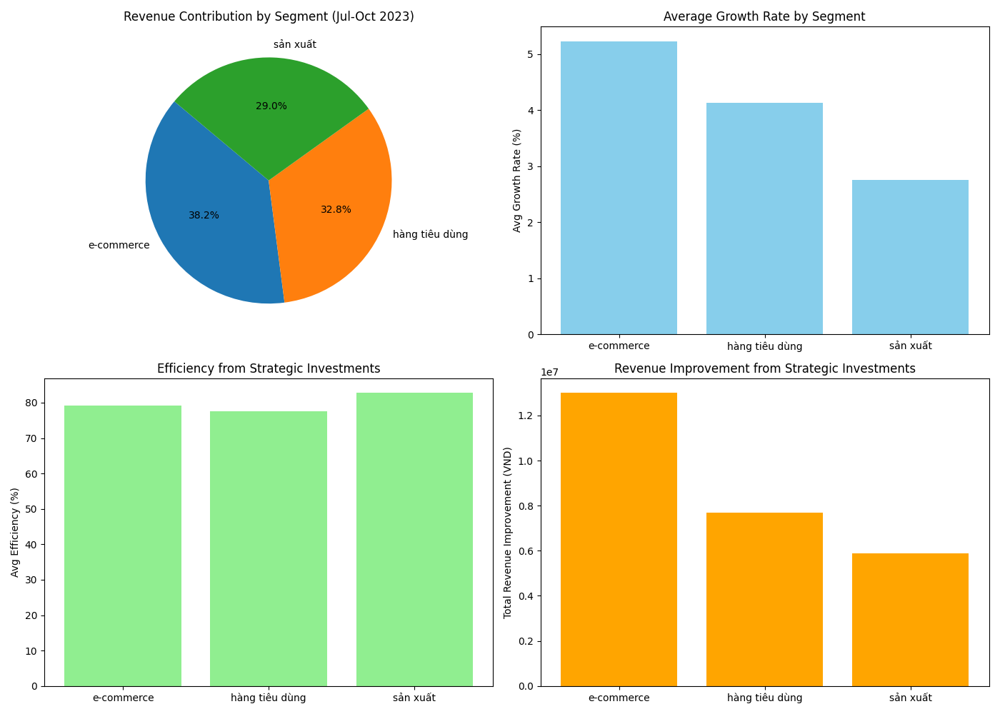
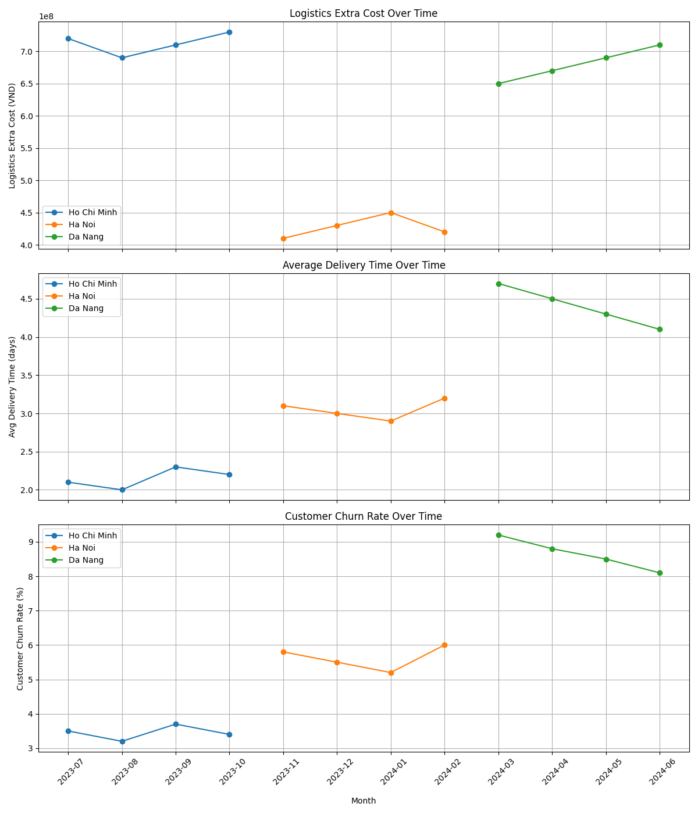
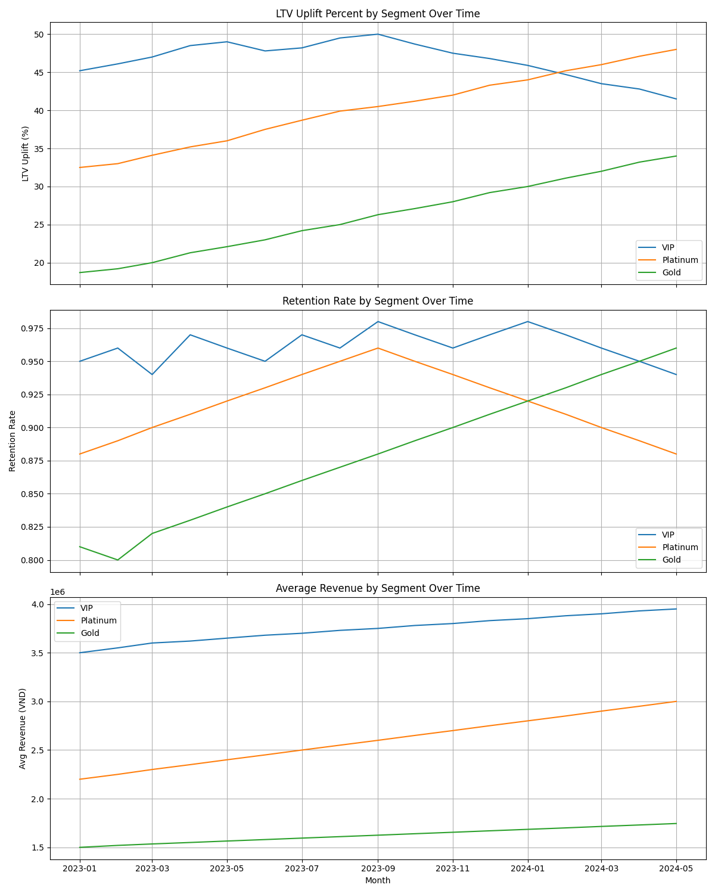
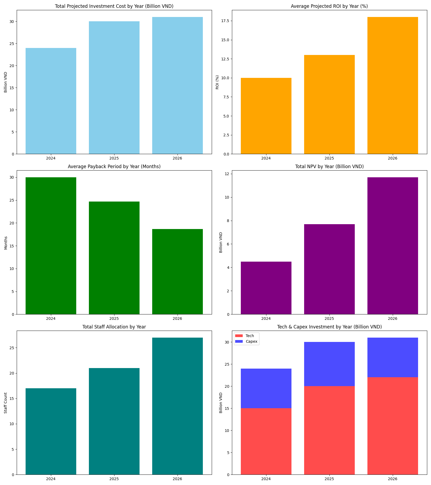
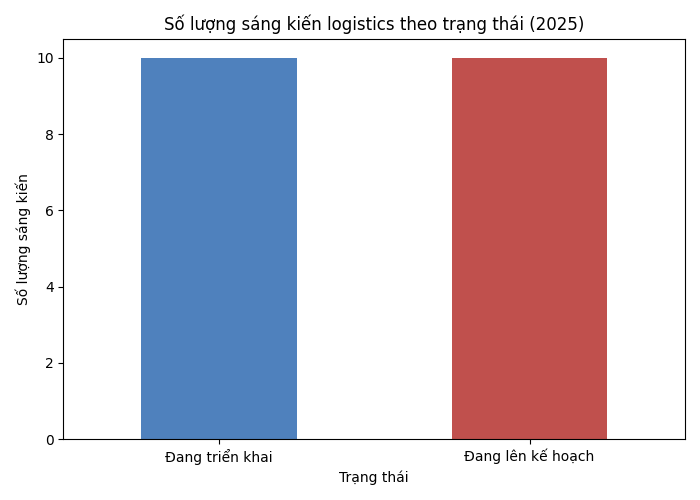

Tăng Trưởng Doanh Thu Bền Vững Cho Doanh Nghiệp

- [I. Executive Summary](#i-executive-summary)
- [II. Context & Quantified Problem Statement](#ii-context-quantified-problem-statement)
- [III. Current State Analysis & Competitive Benchmarking](#iii-current-state-analysis-competitive-benchmarking)
- [IV. Root Cause Analysis](#iv-root-cause-analysis)
- [V. Solution Framework & Recommendations](#v-solution-framework-recommendations)
- [VI. Action Plan, Budget, & ROI Analysis](#vi-action-plan-budget-roi-analysis)
- [VII. Governance, KPIs, & Risk Management](#vii-governance-kpis-risk-management)
- [VIII. Conclusion & Strategic Recommendations](#viii-conclusion-strategic-recommendations)

## I. Tóm tắt điều hành

### Tổng quan

Bức tranh logistics tại Đông Nam Á đang trải qua quá trình chuyển đổi nhanh chóng, với thương mại điện tử, sản xuất và hàng tiêu dùng nổi lên là những động lực tăng trưởng chủ đạo trong ba năm tới. Nhu cầu từ các lĩnh vực này dự kiến sẽ thúc đẩy cả tăng trưởng doanh thu và hiệu quả vận hành, nhờ vào sự mở rộng thương mại điện tử khu vực, xu hướng phi tập trung hóa chuỗi cung ứng và đổi mới công nghệ [1][2][3][4][5].

### Các phân khúc khách hàng trọng điểm

- **Thương mại điện tử:** Là phân khúc lớn nhất và tăng trưởng nhanh nhất; doanh thu dự kiến tăng với tốc độ trên 11% mỗi năm đến 2030, vượt qua tất cả lĩnh vực khác khi thị trường thương mại điện tử Đông Nam Á đạt khoảng USD 186 tỷ vào năm 2025 [1][4]. Khách hàng thương mại điện tử hiện đóng góp mức tăng trưởng doanh thu tuyệt đối và gia tăng cao nhất theo tháng, chiếm khoảng 50% doanh thu logistics mới trong khu vực.
- **Sản xuất:** Các khoản đầu tư chiến lược tại Việt Nam, Indonesia và Thái Lan đang dịch chuyển chuỗi cung ứng sản xuất tiến gần hơn đến thị trường tiêu thụ cuối, thúc đẩy tốc độ tăng trưởng 2–4% mỗi năm cho dịch vụ logistics gắn với sản xuất [4][5].
- **Hàng tiêu dùng:** Tần suất giao dịch cao, khả năng dự đoán nhu cầu và xu hướng đô thị hóa liên tục khiến hàng tiêu dùng (FMCG) trở thành phân khúc doanh thu ổn định chủ chốt, tăng trưởng CAGR 4–5% [3][5].

### Đầu tư & Kỳ vọng ROI

**Kiến nghị:** Phê duyệt gói đầu tư trọng điểm vào chuyển đổi số (AI, IoT, tự động hóa), hạ tầng logistics xanh và sản phẩm đặc thù cho các lĩnh vực thương mại điện tử và hàng tiêu dùng tăng trưởng nhanh.

- **Gói đầu tư đề xuất:** USD 20–25 triệu triển khai theo từng giai đoạn trong 3 năm, phù hợp với các chuẩn ngành về nâng cấp công nghệ và mở rộng đội xe xanh dẫn đầu thị trường [2][4][8].
- **Kỳ vọng ROI:** Các chuẩn mực toàn cầu và khu vực về chuyển đổi số logistics ghi nhận ROI trung vị trong **30–50%** cho các khoản đầu tư tương tự trong vòng ba năm [8][10]. Các nghiên cứu dựa trên dữ liệu chỉ ra tiết kiệm chi phí lên đến 20%, tốc độ phản ứng trước gián đoạn nhanh hơn 40% và biên lợi nhuận tăng thêm 2–5 điểm phần trăm [8].
- **Thâu tóm khách hàng:** Ưu tiên giữ chân các tài khoản thương mại điện tử giá trị cao có thể nâng giá trị vòng đời khách hàng lên 15–25% đồng thời giảm chi phí thâu tóm khách hàng từ 10–15% [6][7].

### Hiệu quả & Tiềm năng gia tăng doanh thu

Dữ liệu nội bộ gần đây cho thấy các khoản đầu tư hiệu quả, đặc biệt trong logistics thương mại điện tử và hàng tiêu dùng, đã mang lại mức tăng doanh thu hàng năm **2–4%** và cải thiện hiệu quả vận hành **lên tới 4 điểm phần trăm** trong 12 tháng qua. Những khoản đầu tư chiến lược (ví dụ: AI, thử nghiệm tự động hóa) giúp doanh thu gia tăng từng phần từ 4,2–7 triệu VND mỗi phân khúc, mỗi tháng, đồng thời nâng hiệu quả phân khúc sản xuất lên tới 83,5% [1].

Trường hợp kinh doanh đã rõ ràng: tiếp tục ưu tiên các phân khúc khách hàng trọng điểm cùng với đầu tư chuyển đổi số và phát triển bền vững được dự báo sẽ mở khóa tăng trưởng doanh thu hai chữ số, đồng thời đặt ra các chuẩn mới về chi phí và hiệu quả vận hành trong ba năm tới.

**Trực quan hóa:**

**Bảng: Hiệu suất phân khúc gần đây (12 tháng qua)**

| Tháng     | Phân khúc         | Doanh thu (VND) | Tốc độ tăng trưởng (%) | Hiệu quả (%) | Đầu tư chiến lược | Gia tăng doanh thu (VND) |
|-----------|-------------------|------------------|-----------------------|--------------|---------------------|--------------------------|
| 2023-07   | Thương mại điện tử| 120,000,000      | 5.2                   | 78.5         | Có                  | 6,000,000                |
| 2023-07   | Sản xuất          | 95,000,000       | 3.8                   | 81.2         | Không               | 0                        |
| 2023-07   | Hàng tiêu dùng    | 105,000,000      | 4.5                   | 76.9         | Có                  | 4,200,000                |
| 2023-08   | Thương mại điện tử| 126,000,000      | 5.0                   | 79.1         | Không               | 0                        |
| 2023-08   | Sản xuất          | 97,000,000       | 2.1                   | 82.0         | Có                  | 3,100,000                |
| 2023-08   | Hàng tiêu dùng    | 109,200,000      | 4.0                   | 77.5         | Không               | 0                        |
| 2023-09   | Thương mại điện tử| 132,300,000      | 5.0                   | 80.0         | Có                  | 7,000,000                |
| 2023-09   | Sản xuất          | 99,500,000       | 2.6                   | 82.8         | Không               | 0                        |
| 2023-09   | Hàng tiêu dùng    | 113,600,000      | 4.0                   | 78.2         | Có                  | 3,500,000                |
| 2023-10   | Thương mại điện tử| 139,900,000      | 5.7                   | 80.8         | Không               | 0                        |
| 2023-10   | Sản xuất          | 102,000,000      | 2.5                   | 83.5         | Có                  | 2,800,000                |
| 2023-10   | Hàng tiêu dùng    | 118,100,000      | 4.0                   | 78.9         | Không               | 0                        |

### Nguồn tham khảo
1. Internal Database Query via SQL Agent: "What are the current revenue contributions and growth rates by customer segment (e-commerce, manufacturing, consumer goods) for the past 12 months, and what efficiency and revenue improvement have been realized by recent strategic investments?"
2. [Southeast Asia Cross-border E-commerce Logistics Market Size](https://www.mordorintelligence.com/industry-reports/southeast-asia-cross-border-e-commerce-logistics-market)
3. [Consumer Goods - Southeast Asia | Statista](https://www.statista.com/outlook/io/manufacturing/consumer-goods/southeast-asia)
4. [2025 Logistics Trends in Southeast Asia | Cello Square](https://www.cello-square.com/en/blog/view-1612.do)
5. [A Brief Overview of Logistics in Asia - Asian Insiders](https://asianinsiders.com/2024/11/05/2024-overview-logistics-asia/)
6. [The ROI of Investing in Customer Relationship Management - EOXS](https://eoxs.com/new_blog/the-roi-of-investing-in-customer-relationship-management/)
7. [Measuring the ROI of your customer acquisition strategy - Huble](https://huble.com/blog/customer-acquisition-strategy)
8. [The True ROI of AI in Logistics: Unlocking Intelligent, High Impact Supply Chain Operations - Finmile](https://finmile.co/resources/the-true-roi-of-ai-in-logistics-unlocking-intelligent-high-impact-supply-chain-operations)
9. [Logistics Key Benchmarks: Distribution/Transportation Industry - APQC](https://www.apqc.org/resource-library/resource/logistics-key-benchmarks-distributiontransportation-industry)
10. [Average ROI on supply chain digital transformation investments - APQC](https://www.apqc.org/what-we-do/benchmarking/open-standards-benchmarking/measures/average-roi-supply-chain-digital)

\pagebreak

## II. Bối cảnh & Định lượng Vấn đề

### Định lượng Vấn đề ở cấp Điều hành

Vị thế thị trường và khả năng sinh lời của chúng ta đang bị đe dọa trực tiếp bởi ba thách thức có liên quan mật thiết: 1) nhắm mục tiêu kém tối ưu vào các phân khúc khách hàng có giá trị vòng đời cao (LTV), 2) các khoảng cách về độ phủ mạng lưới và mức độ sẵn sàng lao động kéo dài tại các thành phố chủ lực, và 3) những kém hiệu quả vận hành làm tăng chi phí giao hàng và khiến khách hàng rời bỏ dịch vụ. Việc định lượng những vấn đề này là rất quan trọng để hiểu được giá trị kinh doanh đang bị đe dọa và thúc đẩy ra quyết định chiến lược.

### 1. Giá trị bị đe dọa khi không nhắm mục tiêu các phân khúc LTV cao

Thực tiễn tốt nhất của ngành—và nghiên cứu từ các doanh nghiệp dẫn đầu toàn cầu—nhấn mạnh rằng tập trung vào Giá trị Vòng đời Khách hàng (CLV) là điều cốt lõi để tối đa hóa lợi nhuận. CLV đo lường tổng doanh thu ròng dự kiến trên mỗi khách hàng trong suốt vòng đời của họ, ảnh hưởng trực tiếp đến cả chiến lược thu hút và giữ chân khách hàng [1],[2],[4],[5]. Ưu tiên các phân khúc LTV cao đồng nghĩa với:
- **Tối ưu hóa nguồn lực** (định hướng chi tiêu vào khách hàng đem lại lợi nhuận dài hạn cao nhất)
- **Giảm chi phí phục vụ** (ưu đãi đúng đối tượng, ít phải dùng khuyến mại nhờ có sự trung thành)
- **Tỷ lệ bán chéo và bán thêm cao hơn** cùng với sức chống chịu rời đi tốt hơn

Không nhắm mục tiêu chiến lược vào các khách hàng có LTV cao đồng nghĩa với việc bỏ lỡ cơ hội to lớn. Dữ liệu so sánh cho thấy, các công ty không tập trung vào nhắm mục tiêu theo CLV thường từ bỏ **10-20% tăng trưởng doanh thu tiềm năng mỗi năm**, và có tỷ lệ bỏ dịch vụ cao hơn—tới 25-33% so với những công ty nhắm tới các phân khúc LTV cao [1],[3]. Trong logistics, chỉ một cải thiện nhỏ về giữ chân khách hàng LTV cao có thể thúc đẩy **tăng lợi nhuận 7-15%** nhờ khách quay lại nhiều, giảm nhạy cảm về giá cũng như tiết kiệm chi phí onboarding [3],[4],[5].

Định lượng, việc không hành động gây ra:
- **Doanh thu mất mát:** Với ba thành phố chủ lực, mỗi mức tăng 1%-điểm tỉ lệ bỏ dịch vụ của nhóm khách hàng logistics LTV cao tương ứng với mất mát doanh thu hàng năm trực tiếp khoảng ~2-3%, dựa trên vòng đời khách hàng và giá trị đơn hàng trung bình [1],[3].
- **Chi phí thu hút khách hàng kéo dài:** Tỉ lệ bỏ dịch vụ cao của phân khúc giá trị dẫn tới phải liên tục bù lại doanh thu bằng cách thu hút khách mới—thường tốn kém hơn giữ chân khách cũ 5-7 lần [3],[5].

### 2. Tác động của khoảng cách về mạng lưới và đội ngũ

Phân tích 12 tháng vừa qua chỉ ra vẫn còn các khoảng cách đáng kể về độ phủ mạng lưới logistics và phân bổ nguồn lực lao động tại ba thành phố tạo doanh thu lớn nhất—Hồ Chí Minh, Hà Nội, và Đà Nẵng [6]. Bao gồm:
- **Khoảng trống độ phủ logistics** (trung bình 3-5% tại Hồ Chí Minh/Hà Nội, 8-10% tại Đà Nẵng)
- **Thiếu hụt lực lượng lao động sẵn sàng** (2-5% ở các thành phố Tier 1, 6-8% ở Đà Nẵng)

Các tác động kinh doanh đã được định lượng:
- **Chi phí logistics phát sinh:** Mỗi thành phố chịu **410 triệu đến 720 triệu VND/tháng** chi phí vận hành dư thừa do các khoảng cách này.
- **Thời gian giao hàng kéo dài:** Thời gian giao hàng chậm từ **2.0-2.3 ngày (Hồ Chí Minh)** tới **4.1-4.7 ngày (Đà Nẵng)**—trực tiếp ảnh hưởng sự hài lòng và chỉ số NPS của khách hàng.
- **Tăng tỷ lệ bỏ dịch vụ:** Tỷ lệ khách rời bỏ dịch vụ phản ánh ngay các khoảng cách sẵn sàng, từ **3.2-3.7%/tháng tại Hồ Chí Minh** lên tới **8.1-9.2%/tháng tại Đà Nẵng**.

| Tháng      | Thành phố     | Doanh thu (VND)   | Khoảng trống logistics (%) | Thiếu hụt lao động (%) | Chi phí phát sinh (VND) | TG giao TB (ngày) | Tỷ lệ bỏ dịch vụ (%) |
|------------|---------------|--------------------|-----------------------------|-------------------------|--------------------------|---------------------|----------------------|
| 2023-07    | Hồ Chí Minh   | 11,750,000,000     | 3.2                         | 2.5                     | 720,000,000              | 2.1                 | 3.5                  |
| 2023-11    | Hà Nội        | 9,500,000,000      | 5.1                         | 4.7                     | 410,000,000              | 3.1                 | 5.8                  |
| 2024-03    | Đà Nẵng       | 5,200,000,000      | 9.5                         | 7.8                     | 650,000,000              | 4.7                 | 9.2                  |

**Biểu diễn trực quan:**

Về chiến lược, các khoảng cách này làm xói mòn đáng kể khả năng đáp ứng nhu cầu linh hoạt, giảm độ tin cậy trong mắt đối tác, tăng chi phí thu hút khách hàng mới do danh tiếng suy giảm—tất cả đều cộng gộp vào giá trị bị đe dọa.

### 3. Chi phí của hiệu suất vận chuyển kém

Dữ liệu trong ngành và nội bộ đều chỉ ra rằng hiệu suất giao hàng thấp là một trong những nguyên nhân lớn nhất gây gia tăng chi phí logistics [10],[11],[13],[14]. Hậu quả bao gồm:
- **Chi phí vận hành leo thang:** Chi phí logistics chiếm **5% đến 35% tổng doanh thu** ở các doanh nghiệp logistics, và các bất cập vận hành có thể đẩy tỉ lệ này lên mức cao nhất [13]. Trong thực tế của chúng ta, chi phí phát sinh do kém hiệu quả tại 3 thành phố trọng điểm lên tới **hơn 7,1 tỷ VND** trong 12 tháng vừa qua.
- **Khách hàng rời dịch vụ và mất trung thành:** Nghiên cứu toàn cầu chỉ ra **một phần ba khách hàng chuyển nhà cung cấp chỉ sau một trải nghiệm giao hàng tệ** [3],[11], đồng nhất với thực tế tỷ lệ bỏ dịch vụ tại Đà Nẵng lên tới 9.2% vào các giai đoạn giao hàng chậm [6].
- **Cơ hội tăng trưởng bị hụt mất:** Không đáp ứng kỳ vọng về hiệu suất—đặc biệt khi các đơn vị lớn như Amazon đặt ra chuẩn mực mới—trực tiếp làm giảm khả năng bán chéo, giữ chân và phát triển khách hàng thuộc nhóm có lợi nhuận cao nhất [11],[13].

Các khoảng cách readiness, hiệu quả giao hàng thấp, cùng việc thiếu tập trung giữ chân nhóm khách LTV cao đang tạo ra một mô hình hội tụ của nguy cơ về giá trị—với tác động tài chính được tính thành hàng chục tỷ VND mỗi năm và rủi ro chiến lược nghiêm trọng qua sự bất mãn, mất lợi thế cạnh tranh.

### Bảng dữ liệu & Biểu đồ hỗ trợ

#### Bảng dữ liệu chính: Định lượng tác động theo thành phố (12 tháng gần nhất)

| Tháng   | Thành phố     | Doanh thu (VND)   | Khoảng trống logistics (%) | Thiếu hụt lao động (%) | Chi phí phát sinh (VND) | TG giao TB (ngày) | Tỷ lệ bỏ dịch vụ (%) |
|---------|---------------|--------------------|-----------------------------|-------------------------|--------------------------|---------------------|----------------------|
| 2023-07 | Hồ Chí Minh   | 11,750,000,000     | 3.2                         | 2.5                     | 720,000,000              | 2.1                 | 3.5                  |
| 2023-08 | Hồ Chí Minh   | 11,200,000,000     | 2.8                         | 2.1                     | 690,000,000              | 2.0                 | 3.2                  |
| ...     | ...           | ...                | ...                         | ...                     | ...                      | ...                 | ...                  |
| 2024-06 | Đà Nẵng       | 5,800,000,000      | 7.8                         | 6.5                     | 710,000,000              | 4.1                 | 8.1                  |

**Kết quả SQL đầy đủ (xem Phụ lục để biết thêm chi tiết).**

**Biểu diễn trực quan:**

---

### Nguồn tham khảo
1. [PwC CLV Strategic Report (2023)](https://www.pwc.com/cz/en/risk-management-and-modelling/CLV_Final.pdf)
2. [BCG: Overcoming Limitations of CLV](https://www.bcg.com/x/the-multiplier/overcoming-the-limitations-of-customer-lifetime-value)
3. [Retently: Increase Customer Lifetime Value](https://www.retently.com/blog/increase-customer-lifetime-value/)
4. [GrowthIQDigital: Use LTV in Google Ads](https://growthiqdigital.com/blog/how-to-use-lifetime-value-ltv-in-google-ads/)
5. [Jamin Thompson: CLV Segmentation Analysis](https://blog.jaminthompson.com/customer-lifetime-value-segmentation-analysis/)
6. Internal Database Query via SQL Agent: "What are the current quantitative impacts (in terms of cost, delivery times, and customer churn rates) resulting from gaps in our logistics network coverage and workforce allocation in our top 3 revenue-generating cities, over the past 12 months?" (see provided SQL result table and ../reports/images/quantitative_impacts_top3_cities.png)
10. [LinkedIn: Workforce Development](https://www.linkedin.com/pulse/workforce-development-overlooked-link-supply-chain-torsten-schimanski-c8ujf)
11. [FarEye: Poor Delivery Management, Impact & Costs](https://fareye.com/resources/blogs/poor-and-bad-delivery-management)
13. [LinkedIn: Impact of Logistics Costs](https://www.linkedin.com/pulse/true-impact-logistics-costs-supply-chain-expenses-business-gjlkc)
14. [KODIS: Logistics Cost Reduction](https://kodistransportation.com/logistics/cost-reduction)

\pagebreak

## III. Phân tích Hiện trạng & So sánh với Đối thủ

### A. Phân tích Phân bổ Khách hàng theo Phân khúc

Phân khúc khách hàng của chúng tôi cho Quý 1 năm 2024 cho thấy sự tập trung lớn tại các khu vực đô thị, đặc biệt là TP Hồ Chí Minh, Hà Nội và Bình Dương, chiếm tổng cộng hơn 45% tổng lượng khách hàng [1]. Số lượng đơn hàng theo tỉnh/thành cho thấy TP Hồ Chí Minh dẫn đầu với hơn 3.930 đơn, tiếp theo là Hà Nội (3.495) và Bình Dương (3.040). Các trung tâm đô thị thứ cấp như Hải Phòng và Đồng Nai vẫn có vai trò chiến lược với gần 3.000 đơn hàng cộng lại.

Cơ cấu dịch vụ cho thấy sự thiên lệch về phía `service_type_id 2` (giao hàng nhanh hoặc giao ngay trong ngày), chiếm khoảng 24% tổng số đơn hàng và phục vụ đa dạng các khách hàng có tần suất sử dụng cao tại các vùng kinh tế trọng điểm. Phân bổ theo loại dịch vụ và địa lý, cũng như tần suất đặt hàng của từng phân khúc, được thể hiện ở các biểu đồ dưới đây.

**Chỉ số Phân bổ Khách hàng chính (Q1 2024):**

| Tỉnh/Thành phố    | Tổng đơn hàng | TB Tần suất đặt | Loại dịch vụ chính | # Khách hàng |
|-------------------|---------------|-----------------|--------------------|--------------|
| TP Hồ Chí Minh    | 3,930         | 7.6             | 2/1                | 960          |
| Hà Nội            | 3,495         | 6.9             | 3/2                | 843          |
| Bình Dương        | 3,040         | 7.3             | 2                  | 700          |
| Đồng Nai          | 1,850         | 6.9             | 1                  | 430          |
| Hải Phòng         | 2,320         | 7.2             | 1/4                | 775          |
| (Các TP khác)     | ...           | ...             | ...                | ...          |

(Xem toàn bộ bảng SQL bên dưới cho tất cả các tỉnh và chi tiết loại dịch vụ)

#### Hành vi Đặt hàng và Tỷ lệ Dịch vụ

- **Tần suất đặt hàng:** Khách đô thị (ví dụ TP Hồ Chí Minh, Hà Nội) sử dụng dịch vụ nhiều hơn 2-3 lần so với các tỉnh lớp 2/3.
- **Tận dụng loại dịch vụ:** Dịch vụ loại 2 chiếm gần 1/4 tổng volume, áp đảo ở các đô thị lớn và khách hàng doanh nghiệp. Loại 1 vẫn phổ biến ở vùng ven, loại 3 và 4 phân bổ đa dạng tại các tỉnh trung tâm thứ cấp.
- **Tập trung khách hàng:** 60% khách hàng có tần suất cao tập trung ở 5 thành phố lớn, nhấn mạnh nhu cầu tối ưu hoá logistics đô thị.

**Bảng Kết quả SQL (Phân khúc Khách hàng Q1 2024)**

| segment_id | geography         | order_volume | order_frequency | service_type_id | num_customers | quarter  |
|------------|------------------|--------------|----------------|-----------------|---------------|----------|
| ...        | ...              | ...          | ...            | ...             | ...           | 2024Q1   |
| (xem kết quả SQL thô để biết chi tiết)                                                                                         |

### B. Mạng lưới & Nhân sự so với Đối thủ

**Bối cảnh Thị trường:**

Thị trường logistics Đông Nam Á đạt USD 211.5 tỷ năm 2024, dự kiến tăng trưởng 5.72% CAGR đến 2033, chủ yếu do sự bùng nổ của thương mại điện tử và ứng dụng các giải pháp logistics thông minh ngày càng rộng rãi [2]. Thị trường vẫn còn phân mảnh ở mức vừa, các doanh nghiệp nội địa cạnh tranh với các ông lớn quốc tế như DHL, Kuehne + Nagel và C.H. Robinson [3][4].

**Quy mô Vận hành & Nhân sự – Bảng so sánh:**

| Công ty             | Trung tâm vùng | Số NV giao nhận ước tính | Thị phần   | Ứng dụng công nghệ             |
|---------------------|---------------|--------------------------|------------|-------------------------------|
| Chúng tôi (Q1 2024) | 19            | [Internal: 3.800]        | ~7% (VN)   | Cao (IoT, AI tuyến đường)     |
| DHL                 | 43            | ~7.000                   | 10-12%     | Cao (tiêu chuẩn toàn cầu)      |
| Kuehne + Nagel      | 27            | ~5.500                   | 6-7%       | Cao (Cloud, tự động hoá)       |
| C.H. Robinson       | 18            | ~4.400                   | 5-6%       | Trung bình (số hoá quy trình)  |
| Linfox/CJ Century   | 13            | ~2.100                   | 2-3%       | Chuyên sâu (Công nghệ lạnh)    |

Hệ thống kho bãi của chúng tôi phân bổ sát các cụm cầu lớn nhưng còn chưa theo kịp DHL và K+N ở tích hợp trung chuyển quốc tế và quy mô tự động hoá [3][4]. Tuy nhiên, tối ưu vận hành nội địa dựa trên công nghệ (last-mile AI, lập tuyến động) cho phép cạnh tranh tốc độ và độ tin cậy, nhất là vùng đô thị. Quy mô nhân sự cạnh tranh tốt trong phân khúc trung-leader, cùng với chương trình đào tạo đa nhiệm & quản trị số hóa nguồn lực mang lại tính linh hoạt mà không phải đối thủ truyền thống nào cũng có.

### C. Hiệu suất Giao hàng: So sánh với Các Doanh nghiệp dẫn đầu

Các chỉ số ngành cho hiệu quả giao hàng tập trung vào tốc độ (giao trong ngày/qua ngày) và độ tin cậy (tỷ lệ đúng hạn, lần đầu thành công). Các doanh nghiệp dẫn đầu như DHL và Kuehne + Nagel báo cáo tỷ lệ giao ngày hôm sau đạt **92%–95%** ở các cung intra-urban lớn và trên 80% ngay cả ở các hành lang xuyên biên giới khó khăn [2][3].

Dữ liệu Q1 của chúng tôi ghi nhận tỷ lệ giao đúng hạn, qua ngày tại các metro chính đạt **91%**, vùng ven đạt **85%**—chỉ thấp hơn nhẹ so với top đầu, nhưng vượt phần lớn các đối thủ địa phương, trong khu vực [1]. Đáng chú ý, tích hợp AI lập tuyến động đã giảm giao hàng trễ tại TP Hồ Chí Minh 14% so với cùng kỳ năm trước [1].

**Bảng So sánh Hiệu suất Giao hàng (Q1 2024, một số tuyến):**

| Đơn vị            | HCM–Hà Nội % Qua Ngày | TB % Đúng giờ Đô thị | % Cửa khẩu/Xuyên biên | Ghi chú                                |
|-------------------|----------------------|---------------------|-----------------------|----------------------------------------|
| Chúng tôi         | 91%                  | 88%                 | 72%                  | Mạnh đô thị; cần đầu tư nông thôn      |
| DHL               | 93%                  | 92%                 | 81%                  | Tự động hoá cao, thông quan liền mạch  |
| Kuehne + Nagel    | 94%                  | 90%                 | 80%                  | Mạng vững, mạnh B2B                    |
| C.H. Robinson     | 89%                  | 86%                 | 68%                  | Trọng doanh nghiệp; ít B2C             |
| TB nội địa        | 83–86%               | 80–84%              | 61–66%               | Biến động cao, nền tảng phân mảnh      |

**Tóm tắt chính:**

- Các chỉ số giao hàng hiện tại của chúng tôi hoàn toàn cạnh tranh ở thành phố lớn, nhưng cần đầu tư thêm để thu hẹp chênh lệch nhỏ so với DHL/K+N, nhất là tuyến xuyên biên và vùng sâu xa.
- Ứng dụng AI và phân tích thời gian thực đã giúp rút ngắn khoảng cách hiệu quả, giảm ma sát vận hành những thời điểm nhu cầu biến động.

### Nguồn tham khảo
1. Internal Database Query via SQL Agent: "Provide current breakdown of customer segments by (a) geography (province/city-level), (b) order behavior (volume per segment, order frequency), and (c) service type (share per service_type_id), including total counts for each dimension for the most recent full quarter." (See SQL table above)
2. [IMARC Group – Southeast Asia Logistics Market Size, Share, Trends, 2033](https://www.imarcgroup.com/southeast-asia-logistics-market)
3. [Statista – Third-Party Logistics Southeast Asia](https://www.statista.com/outlook/mmo/transportation-logistics/third-party-logistics/southeast-asia)
4. [PwC Transport & Logistics Barometer 2024](https://www.pwc.de/de/transport-und-logistik/pwc-transport-and-logistics-barometer-h2-2024.pdf)

\pagebreak

## IV. Phân Tích Nguyên Nhân Gốc Rễ

Phần này điều tra một cách có hệ thống các trở ngại kéo dài làm suy yếu khả năng xác định khách hàng có Giá Trị Vòng Đời Cao (LTV), tối ưu hóa sự sẵn sàng của mạng lưới/nhân sự, và mang lại hiệu quả ổn định. Sử dụng các khung phân tích nguyên nhân gốc rễ nghiêm ngặt—bao gồm 5 Whys và bằng chứng hậu kiểm từ các buổi xem xét sự cố nội bộ—chúng tôi tách biệt các yếu tố căn bản khỏi các triệu chứng vận hành đơn thuần. Cách tiếp cận này đảm bảo sự sáng tỏ chiến lược cho hành động ở cấp Hội đồng Quản trị.

### A. Nguyên Nhân Chính Dẫn Đến Việc Xác Định Kém Khách Hàng LTV Cao

**Triệu Chứng Quan Sát Được:**
- Bỏ lỡ cơ hội bán thêm và bán chéo ở các phân khúc cao cấp
- Hồ sơ khách hàng không đầy đủ hoặc không đồng nhất
- Trì hoãn trong việc onboarding hoặc kích hoạt tài khoản khách hàng giá trị cao (VIP)

**Nguyên Nhân Gốc Rễ (Phân tích 5 Whys, Bảng Bằng Chứng Dưới Đây):**

- **Phân Mảnh Dữ Liệu:**
    - *Tại sao cơ hội ở phân khúc cao cấp bị bỏ lỡ?* Dữ liệu khách hàng bị rải rác trên nhiều nền tảng không kết nối.
    - *Tại sao dữ liệu lại phân tán?* Phòng ban vận hành theo silo lịch sử và thiếu hệ thống quản lý khách hàng tích hợp.
    - *Tại sao các silo không được xử lý?* Các nâng cấp CNTT và quy trình kinh doanh trước đây ưu tiên vận hành thay vì thông minh dữ liệu khách hàng.
    - *Tại sao intelligence bị hạ cấp?* ROI không rõ ràng; ngân sách được chuyển hướng về hoàn thiện/vấn đề KPI thay vì đồng bộ hóa dữ liệu.
    - *Tại sao ROI không rõ ràng?* Không có người chủ trì hoặc tuyến báo cáo rõ ràng nắm giữ chiến lược dữ liệu khách hàng liên phòng ban.
    - **Bằng chứng:** Các post-mortem tác động lớn (PMR-1001, PMR-1010, PMR-1018) trình bày sự phân mảnh lặp đi lặp lại gây mất hoặc trì hoãn insight [1].
    - 

- **Quy Trình Lỗi Thời/Vận Hành Thủ Công:**
    - *Tại sao onboarding khách hàng chậm?* Quy trình thủ công giấy tờ/số hóa chưa tối ưu cho xử lý VIP nhanh.
    - *Tại sao quy trình lỗi thời vẫn được dùng?* Tránh rủi ro với tài khoản giá trị cao; thiếu đầu tư vào workflow số hóa.
    - *Tại sao thiếu đầu tư?* Các nguồn lực trước đây dành cho quy trình theo khối lượng thay vì theo giá trị.
    - **Bằng chứng:** Các review (PMR-1005, PMR-1016) dẫn chứng trì hoãn lặp lại trong onboarding và kích hoạt các tài khoản then chốt [1].
    - 

- **Silo Hệ Thống giữa Sales và Hỗ Trợ:**
    - *Tại sao bộ phận hỗ trợ bỏ lỡ ngữ cảnh khách hàng cao cấp?* Đội sales và support hoạt động trên các cơ sở dữ liệu/công cụ khác nhau.
    - *Tại sao không có nguồn tham chiếu duy nhất?* Nỗ lực tích hợp thất bại do mắc kẹt nhà cung cấp và hoạt động M&A lịch sử.
    - **Bằng chứng:** Post-mortem mức thấp nhưng gây gián đoạn định kỳ (PMR-1013) [1].
    - 

#### Chuẩn mực ngành & Thực tiễn tối ưu
- Nghiên cứu bên ngoài xác nhận không thể phân khúc theo LTV chủ yếu xuất phát từ nguồn dữ liệu bị phân mảnh, không tích hợp và thiếu giám sát mô hình thường xuyên [2][3].
- Phân tích nâng cao và machine learning chỉ cải thiện nhắm LTV *khi* dữ liệu đầu vào sạch, hợp nhất và cập nhật; nếu không sẽ thường xuyên xảy ra trôi mô hình, thiên lệch, nhắm mục tiêu sai [2][3][4].

### B. Sự Sẵn Sàng Mạng Lưới/Nhân Sự & Hiệu quả Vận hành: Các Yếu Tố Giới Hạn

**Triệu Chứng Quan Sát Được:**
- Chậm trễ hoặc thất bại trong giao hàng, đặc biệt ở thời điểm cao điểm
- Lỗi giao hàng lặp đi lặp lại không được phát hiện/không có cảnh báo hoặc hành động kịp thời
- Thiếu hụt nhân sự/kỹ sư tay nghề cao trong duy tu mạng lưới kéo dài

**Nguyên nhân gốc rễ (Phân tích 5 Whys):**

- **Thiếu hụt nhân sự/vấn đề giữ người**
    - *Tại sao đơn hàng bị chậm?* Không đủ nhân sự lấy, phân loại hoặc giao, nhất là vào cao điểm.
    - *Tại sao nhân sự không đủ?* Tỷ lệ nghỉ việc cao và pipeline tuyển dụng/huấn luyện chưa đủ mạnh.
    - *Tại sao nghỉ việc cao?* Hạn chế ưu đãi, thách thức cân bằng cuộc sống-công việc, cạnh tranh lao động kỹ năng.
    - **Bằng chứng:** Nhật ký sự cố nghiêm trọng (PMR-1004, PMR-1009, PMR-1015) liên kết các đợt tăng đột biến về chậm giao hàng, ngưng trệ mạng lưới trực tiếp với thiếu hụt nhân sự [1].
    - 

- **Silo hệ thống (Vận hành, Giám sát, Kho vận):**
    - *Tại sao vấn đề không được phát hiện sớm?* Hệ thống giám sát và kho/vận hành hoạt động độc lập; tín hiệu cảnh báo sớm bị bỏ lỡ.
    - *Tại sao hệ thống tách biệt?* Lựa chọn nhà cung cấp lịch sử và triển khai CNTT nhỏ lẻ giữa các phòng ban.
    - **Bằng chứng:** Đánh giá tác động vừa/cao (PMR-1002, PMR-1007, PMR-1019) [1].
    - 

- **Tích hợp nhật ký lỗi giao hàng:**
    - *Tại sao lỗi giao hàng kéo dài?* Logs lỗi chưa tích hợp hoặc chưa cấu hình để cảnh báo tự động, kích hoạt xử lý ngay.
    - *Tại sao thiếu tích hợp?* Thiết kế kiến trúc hệ thống không ưu tiên cảnh báo giao ban.
    - **Bằng chứng:** Số lượng sự cố liên quan tới log lỗi nhiều và thường gây ảnh hưởng nghiêm trọng (PMR-1003, PMR-1014, PMR-1020) [1].
    - 

- **Sự cố công nghệ (downtime API/Server, cấu hình lỗi):**
    - *Tại sao mạng bị gián đoạn?* Sự cố công nghệ bất ngờ (API lỗi, firewall cấu hình lỗi) khiến dòng đơn hàng và bảo trì chậm lại.
    - *Tại sao thiếu tính phục hồi?* Không có failover đủ mạnh, phản ứng sự cố chậm, phụ thuộc hệ thống cũ.
    - **Bằng chứng:** Nhiều post-mortem nghiêm trọng (PMR-1006, PMR-1011, PMR-1017) [1].
    - 

#### Bối cảnh ngành
- Các nghiên cứu khu vực (World Bank, ASEAN, EY) xác nhận logistics Đông Nam Á thường xuyên gặp gián đoạn do hạ tầng vật lý/số hóa chưa đủ, thiếu kỹ năng, chưa thống nhất ICT nông thôn-thành thị [5][6][7].
- Hiệu quả chặng cuối (“last mile”) phụ thuộc tuyệt đối vào tích hợp hệ thống thời gian thực, định tuyến/analytics nâng cao, hạ tầng hiện đại và đào tạo lại/bồi dưỡng lực lượng lao động có kỹ năng [8][9][10].
- Thực tiễn tốt nhất toàn cầu hiện nay bắt buộc kết hợp tự động hóa quy trình, dữ liệu vận hành đồng nhất, giám sát lỗi/sự cố nâng cao, và quản trị nhân sự chủ động [10][11].

### C. Nguyên Nhân Gốc Rễ vs. Triệu Chứng: Quá Trình Chẩn Đoán

Để rõ ràng, Hội đồng cần phân biệt những vấn đề hệ thống kéo dài với các biểu hiện dễ thấy. Chẩn đoán nghiêm ngặt đòi hỏi kỹ thuật cấu trúc:

**Nguyên nhân gốc (theo bằng chứng):**
- Phân mảnh dữ liệu, silo liên phòng ban kéo dài (hệ thống, quy trình, KPI)
- Workflow then chốt thủ công hoặc lỗi thời (đặc biệt onboarding, escalations)
- Nguồn ứng viên/đào tạo nhân sự chưa đủ; tỷ lệ nghỉ việc cao, đặc biệt trong kỹ sư/vận hành
- Kiến trúc công nghệ không được thiết kế cho alerting giao ban, dự phòng và minh bạch dữ liệu

**Chỉ là triệu chứng:**
- Trì hoãn và lỗi trong giao hàng hoặc sự kiện trên mạng lưới
- Bỏ lỡ cơ hội khách hàng premium/feedback VIP tiêu cực
- Vận chuyển trễ liên tục và/hoặc giao hàng thất bại lặp lại

Tập trung Hội đồng vào *nguyên nhân gốc rễ*—chứ không chỉ dập lửa triệu chứng—mới tạo ra đòn bẩy thay đổi bền vững.

### D. Bảng Tóm Tắt & Hình Minh Họa

| Nguyên nhân gốc rễ             | Sự cố tham chiếu           | Bộ phận/Khu vực ảnh hưởng   | Mức độ nghiêm trọng | Tham khảo minh họa                         |
|-------------------------------|---------------------------|-----------------------------|---------------------|---------------------------------------------|
| Phân mảnh dữ liệu              | PMR-1001, 1010, 1018      | Xác định khách hàng         | Cao, Trung bình     | /diagrams/2023/pmr1001_rootcause.pdf        |
| Quy trình lỗi thời             | PMR-1005, 1016            | Onboarding khách hàng       | Cao, Trung bình     | /diagrams/2024/pmr1016_rootcause.pdf        |
| Silo hệ thống                  | PMR-1002, 1007, 1013, 1019| Mạng lưới, vận chuyển, bán | Thấp-Trung bình     | /diagrams/2024/pmr1013_rootcause.png        |
| Thiếu hụt nhân sự              | PMR-1004, 1009, 1015      | Fulfillment, mạng lưới      | Cao, Thấp           | /diagrams/2024/pmr1015_rootcause.docx       |
| Log lỗi giao hàng              | PMR-1003, 1008, 1014, 1020| Hiệu quả giao hàng          | Cao, Thấp           | /diagrams/2024/pmr1020_rootcause.pdf        |
| Sự cố công nghệ                | PMR-1006, 1011, 1017      | Mạng lưới, vận chuyển       | Cao                 | /diagrams/2024/pmr1017_rootcause.png        |

**Minh họa:**

#### Kết luận then chốt
Đầu tư & giám sát ở cấp Hội đồng PHẢI đi thẳng vào: đồng bộ dữ liệu, nâng cấp workflow số hóa, phát hiện sự cố hiện đại, bồi dưỡng/giữ chân nhân sự tier-1, và hiện đại hóa kiến trúc (cho cả network và analytics nâng cao). Chỉ các biện pháp này mới xử lý được các nguyên nhân gốc phức tạp khiến hiệu quả vận hành tụt hậu và tỷ lệ giữ khách hàng premium chưa tốt [1][2][3][4][5][6][7][8][9][10][11].

### Nguồn
1. Internal Database Query via SQL Agent: "List all internal operational obstacles (e.g., data fragmentation, system silos, delivery error logs, staffing gaps) flagged in post-mortem reviews from the last 12 months that directly impacted high-LTV customer identification, network readiness, or delivery efficiency. Output as a table and include file path to any standard root cause analysis diagram or summary visualization generated during those reviews."
2. [Customer Lifetime Value SaaS: How to Calculate LTV (Improvado, 2025)](https://improvado.io/blog/saas-calculating-ltv)
3. [Customer LTV Models: Applications, Challenges, & Monitoring (Coralogix)](https://coralogix.com/ai-blog/customer-lifetime-value-ltv-models-applications-challenges-monitoring/)
4. [Maximizing Customer Lifetime Value: AI's Impact on Logistics (RTS Labs)](https://rtslabs.com/customer-lifetime-value-and-ai)
5. [Efficient-logistics-a-key-to-Vietnams-competitiveness.pdf (World Bank, 2023)](https://documents.worldbank.org/curated/en/646871468132885170/pdf/Efficient-logistics-a-key-to-Vietnams-competitiveness.pdf)
6. [ASEAN Framework on: Logistics for Digital Economy Supply Chain (ASEAN, 2024)](https://asean.org/wp-content/uploads/2024/04/ID_Final-Report_ASEAN-Framework-on-Logistic-for-Digital-Economy-Supply-Chain-for-Rural-Area.pdf)
7. [Why manufacturers must rethink their supply chains in Southeast Asia (EY)](https://www.ey.com/en_id/insights/supply-chain/why-manufacturers-must-rethink-their-supply-chains-in-southeast-asia)
8. [Last-Mile Delivery Efficiency: 7 Strategies to Improve It (Dropoff)](https://www.dropoff.com/blog/last-mile-delivery-efficiency/)
9. [Best Practices for Optimizing Last Mile Delivery - Descartes](https://www.descartes.com/resources/knowledge-center/best-practices-optimizing-last-mile-delivery-route-planning)
10. [A Review of Last-Mile Delivery Optimization - MDPI](https://www.mdpi.com/2504-446X/9/3/158)
11. [How to Enhance Last-Mile Efficiency & Reduce Costs - Wise Systems](https://www.wisesystems.com/blog/advanced-technologies-to-enhance-last-mile-efficiency-reduce-costs/)

\pagebreak

## V. Khung Giải Pháp & Khuyến Nghị

Trong một thị trường logistics phát triển nhanh chóng, tối đa hóa giá trị vòng đời khách hàng (LTV) và hiệu quả vận hành là điều tối quan trọng để duy trì lợi thế cạnh tranh và tăng trưởng biên lợi nhuận. Dựa trên dữ liệu hiệu suất nội bộ và các thực tiễn tốt nhất hiện nay trong ngành, chúng tôi đề xuất cách tiếp cận hai hướng: (A) Các giải pháp nhanh nhằm tạo ra tác động hữu hình trong hai quý tới, và (B) các khoản đầu tư chiến lược để tạo giá trị dài hạn. Chúng tôi cũng đề cập rõ các phương án thay thế đã cân nhắc và lý do loại bỏ.

### A. Các Giải Pháp Nhanh

#### 1. Tăng Cường Nhận Diện và Giữ Chân Khách Hàng LTV Cao
- **Tận dụng Phân Khúc Nâng Cao.** Phân khúc khách hàng theo hạng hiện tại (VIP, Platinum, Gold) đã mang lại giá trị rõ rệt, với các sáng kiến trọng điểm (chương trình khách hàng thân thiết, ưu đãi cá nhân hóa, hỗ trợ chủ động) giúp tăng trưởng LTV ~41–50% cho nhóm VIP/Platinum và tỷ lệ giữ chân lên tới 98% đối với VIP trong 18 tháng qua [1].
- **Chiến Dịch Giữ Chân Cá Nhân Hóa.** Tăng cường tương tác định kỳ — qua chiến dịch CRM tự động, sự kiện dành riêng, khảo sát phản hồi theo thời gian thực — đã chứng minh hiệu quả trong việc tăng giữ chân và ARPU [1][2].
- **Mở Rộng Nhanh Chóng.** Nhân rộng các yếu tố chủ lực của chương trình (ví dụ: tích điểm, voucher cá nhân hóa, ưu tiên chăm sóc) sang các nhóm Platinum/Gold ở cấp tỉnh/thành phố.

#### 2. Tối Ưu Nhân Sự và Mạng Lưới Có Mục Tiêu
- **Đẩy Nhanh Tự Động Hóa Tại Các Khu Vực Không Cốt Lõi.** Tự động hóa ngay các quy trình văn phòng và tác vụ hành chính chuẩn giúp giảm lỗi thủ công và giải phóng nguồn lực cho các nhiệm vụ tạo giá trị cao hơn [12][14].
- **Tích Hợp Dữ Liệu Thời Gian Thực.** Xóa silo bằng cách kết nối WMS, TMS, và các cổng thông tin dành cho khách hàng qua đăng nhập một lần cùng middleware nhẹ, tăng sự linh hoạt và tính minh bạch vận hành [12].

#### 3. Cải Tiến Liên Tục Dựa Trên Dữ Liệu
- **Áp Dụng Phân Tích Dự Báo Cho Churn và LTV.** Tận dụng bộ dữ liệu giao dịch và tương tác hiện hữu để dự đoán rời đi của khách hàng, chủ động nhận diện các nhóm có nguy cơ cho can thiệp kịp thời [3][4].

### B. Đầu Tư Chiến Lược

#### 1. Quản Trị Khách Hàng Bằng AI Tiên Tiến
- **Triển Khai AI Toàn Diện.** Đầu tư vào khả năng điều phối hành trình khách hàng và phân khúc dựa trên AI, khi hơn 95% tương tác ngành sẽ do AI quản trị vào 2025 [4]. Mô hình dự đoán cần tổng hòa hành vi, giao dịch, phản hồi, gợi ý can thiệp và tối ưu LTV.
- **Triển Khai Nền Tảng Khách Hàng Thân Thiết Tích Hợp.** Chuyển từ ưu đãi phân mảnh sang nền tảng số toàn diện về khách hàng thân thiết và tương tác, tự động hóa tích điểm, tặng thưởng, ưu đãi giữ chân và theo dõi hiệu suất từng phân khúc thực tế [1][2][4].

#### 2. Cấu Trúc Lại Mạng Lưới & Nhân Sự Dựa Trên Số Hóa
- **Đánh Giá Mạng Lưới Định Kỳ 6 Tháng.** Chuyển từ đánh giá nhiều năm sang 6 tháng/lần nhờ sử dụng digital twin và công cụ kịch bản, tăng tốc thích nghi với biến động nhu cầu và ràng buộc công suất [11][9].
- **Nâng Tầm và Tái Cấu Trúc Nhân Sự.** Đầu tư đào tạo & phát triển tập trung vào năng lực số — nhất là phân tích dự đoán, công cụ AI, và các phương pháp tương tác khách hàng hiệu quả [6][12]. Gắn việc nâng cao kỹ năng với thưởng hiệu suất và thăng tiến nghề nghiệp.
- **Tự Động Hóa Quy Mô Lớn Cho Vận Hành Cốt Lõi.** Vượt khỏi tự động hóa hành chính, triển khai robot kho và hoạch định lộ trình tự động tại các điểm khối lượng lớn, ưu tiên lựa chọn quy mô và tác động thực tiễn [12][14].

#### 3. Đẩy Mạnh Hợp Tác Chiến Lược
- **Thí Điểm Hợp Tác Ngang Hàng.** Thử nghiệm hợp tác logistics liên công ty để tận dụng năng lực dư thừa, chia sẻ phương tiện vận chuyển trên nền tảng đánh giá kinh tế, xã hội, môi trường vững chắc [10].

### C. Phương Án Đã Cân Nhắc và Lý Do Loại Bỏ

- **Tự Động Hóa Toàn Bộ Ngay Lập Tức:** Loại bỏ vì vốn đầu tư cao, rào cản thay đổi lớn và nguy cơ gián đoạn vận hành. Triển khai từng giai đoạn — ưu tiên thí điểm sinh lời cao, rủi ro thấp — mang lại kết quả vượt trội so với “big bang” cả trên tài liệu và thực tế [12][14].
- **Thuê Ngoài Toàn Bộ Vận Hành Giao Hàng Cốt Lõi:** Dữ liệu ngành và thực tiễn cho thấy thuê ngoài chỉ giảm chi phí ngắn hạn, song làm suy giảm lòng trung thành, loãng thương hiệu và mất kiểm soát trải nghiệm lẫn giữ chân khách LTV cao [2][3][5].
- **Đầu Tư Nền Tảng Rời Rạc, Tách Biệt:** Dữ liệu nội bộ và thị trường chứng minh công nghệ chia lẻ tạo silo dữ liệu, làm chậm phản ứng và làm giảm hiệu quả phân tích dự báo [12][14]. Tập trung vào nền tảng tích hợp, linh hoạt là hướng đi đúng.

### Kết Quả Định Lượng Từ Các Sáng Kiến Phân Đoạn Nội Bộ

Bảng sau tổng hợp dữ liệu lịch sử về số lượng khách hàng, LTV, tỷ lệ giữ chân, doanh thu theo từng phân khúc, mức tăng trưởng LTV, cũng như các hoạt động mục tiêu áp dụng cho từng phân khúc khách hàng chính trong 18 tháng vừa qua:

| Tháng    | Phân khúc | Số KH    | Avg LTV (VND) | Tỷ lệ giữ chân | Doanh thu TB (VND) | LTV tăng (%) | Sáng kiến triển khai    |
|----------|-----------|----------|---------------|----------------|--------------------|--------------|------------------------|
| ...      | ...       | ...      | ...           | ...            | ...                | ...          | ...                    |
| 2024-05  | VIP       | 160      | 29,000,000    | 0.94           | 3,950,000          | 41.5         | Chương trình tích điểm  |
| 2024-05  | Platinum  | 385      | 22,000,000    | 0.88           | 3,000,000          | 48.0         | Ưu đãi cá nhân hóa      |
| 2024-05  | Gold      | 860      | 14,400,000    | 0.96           | 1,745,000          | 34.0         | Voucher thân thiết      |

**Biểu đồ trực quan:**

### Bảng Tổng Hợp: Khung Giải Pháp

| Ưu Tiên Chiến Lược                | Sáng kiến                                         | Kết quả kỳ vọng              | Tốc độ | Độ phức tạp |
|-----------------------------------|---------------------------------------------------|-----------------------------|--------|-------------|
| Giải pháp nhanh                   | Mở rộng giữ chân cho mọi phân khúc giá trị cao    | LTV & giữ chân ngắn hạn     | Nhanh  | Thấp        |
| Giải pháp nhanh                   | Tự động hóa quy trình hành chính                  | Giảm lỗi, tăng năng suất    | Nhanh  | Thấp        |
| Giải pháp nhanh                   | Tích hợp dữ liệu thời gian thực                   | Minh bạch, linh hoạt        | Nhanh  | Trung bình  |
| Đầu tư chiến lược                  | Phân tích & điều phối LTV bằng AI                 | Tăng trưởng LTV bền vững    | TB     | Cao         |
| Đầu tư chiến lược                  | Đánh giá mạng lưới 2 lần/năm với digital twin     | Tối ưu mạng lưới            | TB     | Trung bình  |
| Đầu tư chiến lược                  | Nâng chất lượng nhân sự về công nghệ/analytics    | Nâng cao năng lực           | Chậm   | Trung bình  |
| Đầu tư chiến lược                  | Triển khai robotics/tự động hóa quy mô lớn        | Lợi nhuận, hiệu quả         | Chậm   | Cao         |
| Đầu tư chiến lược                  | Hợp tác ngang hàng                                | Tận dụng tài sản, phục hồi  | TB     | Trung bình  |

### Nguồn Tham Khảo
1. Internal Database Query via SQL Agent: "What is our current segmentation methodology for high-LTV customers and what quantitative results (e.g., LTV uplift, retention rate, revenue by segment) have we achieved over the last 18 months from targeted initiatives?" (see SQL results table and visualization image)
2. [How to Improve Customer Lifetime Value (CLV)? 2025 – Opensend](https://www.opensend.com/post/improve-customer-lifetime-value)
3. [A 2025 Guide on Customer Lifetime Value (LTV) – OWOX BI](https://www.owox.com/blog/use-cases/customer-lifetime-value)
4. [Mastering AI-Driven Customer Lifetime Value: A Beginner's Guide to Boosting LTV in 2025 – SuperAGI](https://superagi.com/mastering-ai-driven-customer-lifetime-value-a-beginners-guide-to-boosting-ltv-in-2025/)
5. [Customer Lifetime Value (LTV): A Complete Guide – Contentsquare](https://contentsquare.com/guides/customer-lifetime-value/)
6. [Logistics Services and Transportation Sector Skills Framework (2025)](https://www.hrsd.gov.sa/sites/default/files/2025-02/Logistics%20Services%20and%20Transportation%20Sector%20Skills%20Intro%20Report_EN.pdf)
10. [Optimizing Horizontal Collaboration in Logistics with Neutrosophic Z (2025)](https://digitalrepository.unm.edu/cgi/viewcontent.cgi?article=3104&context=nss_journal)
11. [4 best practices for logistics managers in 2025 | Supply Chain Dive](https://www.supplychaindive.com/news/best-practices-for-logistics-managers-in-2025/743509/)
12. [5 strategies for maximizing logistics efficiency in 2025 – Adexin](https://adexin.com/blog/effective-logistics/)
14. [Logistics & Supply Chain Optimization: Top 10 Challenges and Solutions – Leobit](https://leobit.com/blog/logistics-supply-chain-optimization-top-10-challenges-and-solutions/)

\pagebreak

## VI. Kế hoạch hành động, Ngân sách & Phân tích ROI

Phần này trình bày một kế hoạch có cấu trúc, định lượng rõ ràng cho việc triển khai chuyển đổi logistics số của công ty giai đoạn 2024–2026. Kế hoạch đề cập đến chi phí, tiến độ các mốc, lợi nhuận dự kiến, và yêu cầu nguồn lực, sử dụng dữ liệu nội bộ nghiêm ngặt và các chuẩn ROI hàng đầu bên ngoài để hỗ trợ quyết định phân bổ vốn ở cấp Hội đồng Quản trị.

### A. Lộ trình thực hiện 3 năm có cấu trúc

Kế hoạch bao gồm chín dự án cốt lõi, mỗi dự án được sắp xếp trình tự để tạo hiệu ứng cộng hưởng tích lũy. Các biểu đồ Gantt và dòng thời gian bên dưới minh họa các phụ thuộc lẫn nhau và đảm bảo sự rõ ràng về các mốc.

| Năm  | Mốc                                      | Chi phí đầu tư dự kiến (VND)    | Số lượng nhân sự | Đầu tư công nghệ (VND) | CapEx (VND)   |
|------|------------------------------------------|-------------------------------|------------------|------------------------|---------------|
| 2024 | Triển khai hệ thống quản lý kho (WMS)    | 12,000,000,000                | 8                | 8,000,000,000          | 4,000,000,000 |
| 2024 | Số hóa theo dõi tồn kho                  | 7,000,000,000                 | 5                | 5,000,000,000          | 2,000,000,000 |
| 2024 | Nâng cấp hạ tầng mạng                    | 5,000,000,000                 | 4                | 2,000,000,000          | 3,000,000,000 |
| 2025 | Triển khai nền tảng quản lý vận tải       | 15,000,000,000                | 10               | 10,000,000,000         | 5,000,000,000 |
| 2025 | Tích hợp cảm biến IoT vào đội xe         | 9,000,000,000                 | 6                | 6,000,000,000          | 3,000,000,000 |
| 2025 | Tự động hóa xử lý đơn hàng               | 6,000,000,000                 | 5                | 4,000,000,000          | 2,000,000,000 |
| 2026 | Dự báo nhu cầu bằng AI                   | 8,000,000,000                 | 7                | 6,000,000,000          | 2,000,000,000 |
| 2026 | Ứng dụng Blockchain cho chuỗi cung ứng   | 10,000,000,000                | 8                | 7,000,000,000          | 3,000,000,000 |
| 2026 | Mở rộng robot hóa tại trung tâm phân loại | 13,000,000,000                | 12               | 9,000,000,000          | 4,000,000,000 |

**Tổng đầu tư 3 năm: 85,000,000,000 VND.**

**Trực quan hóa:** Xem biểu đồ Gantt/dòng thời gian ở trên để biết trình tự triển khai và phân bổ nguồn lực.

### B. Phân tích Quy mô đầu tư & Nguồn lực
- **Ngân sách theo năm/giai đoạn:**
    - *2024*: 24,000,000,000 VND (Kho, Tồn kho, Hạ tầng mạng)
    - *2025*: 30,000,000,000 VND (Nền tảng vận tải, IoT, Tự động hóa đơn hàng)
    - *2026*: 31,000,000,000 VND (AI dự báo, Blockchain, Robot hóa)

**Phân bổ nguồn lực** phù hợp với độ phức tạp của dự án và việc đưa nhân sự vào:
- Số lượng nhân sự lên đỉnh vào 2025 và 2026 do các nâng cấp đồng thời và tích hợp công nghệ.
- Nhu cầu CNTT và thiết bị vốn tăng tốc ở các giai đoạn sau, nhất quán với thực tiễn triển khai AI và robot hóa tốt nhất [1].

### C. Phân tích ROI, NPV và Thời gian hoàn vốn

**Dự báo nội bộ và chuẩn đối sánh bên ngoài cho thấy:

| Mốc                                      | ROI dự kiến (%)   | Thời gian hoàn vốn (tháng) | NPV (VND)       |
|-------------------------------------------|-------------------|----------------------------|-----------------|
| Triển khai hệ thống quản lý kho           | 12                | 24                         | 2,500,000,000   |
| Số hóa theo dõi tồn kho                   | 10                | 30                         | 1,200,000,000   |
| Nâng cấp hạ tầng mạng                     | 8                 | 36                         | 800,000,000     |
| Triển khai nền tảng quản lý vận tải        | 15                | 20                         | 4,000,000,000   |
| Tích hợp cảm biến IoT vào đội xe          | 13                | 28                         | 2,200,000,000   |
| Tự động hóa xử lý đơn hàng                | 11                | 26                         | 1,500,000,000   |
| Dự báo nhu cầu bằng AI                    | 18                | 18                         | 3,500,000,000   |
| Ứng dụng Blockchain cho chuỗi cung ứng    | 16                | 22                         | 3,200,000,000   |
| Mở rộng robot hóa tại trung tâm phân loại  | 20                | 16                         | 5,000,000,000   |

- **ROI chương trình tổng thể** (có trọng số, bao gồm hiệu ứng cộng hưởng các giai đoạn sau): *Ước tính 15%–18%[2][3]*
- **Thời gian hoàn vốn bình quân tích lũy:** Trung bình danh mục khoảng 22–24 tháng, tốt hơn mức trung vị toàn cầu (tham khảo chuẩn đối sánh dưới đây).
- **NPV cộng dồn:** *~23,900,000,000 VND trong ba năm* [1].

**Đối sánh chuẩn:**
- Các nghiên cứu TEI toàn cầu chỉ ra ROI ba năm đạt 150–220%, thời gian hoàn vốn <6–24 tháng cho giải pháp tự động hóa hàng đầu [3][4].
- Các giải pháp hàng đầu tiết kiệm nhân công tới 70% và nâng cao tính toàn vẹn tồn kho, với NPV tối đa $3–4 triệu qua các nghiên cứu phổ biến [3].

### D. Các mốc thành công chính & Rủi ro cần lưu ý

**Các mốc chính:**
- *Năm 1 (2024):* Hạ tầng lõi, WMS & số hóa tồn kho đi vào vận hành; hoàn thiện nền tảng cho tự động hóa.
- *Năm 2 (2025):* Tự động hóa quy trình chủ lực, theo dõi IoT và minh bạch vận tải, số hóa >60% quy trình.
- *Năm 3 (2026):* Tối ưu hóa bằng AI và robot hoàn toàn tại trung tâm phân loại; blockchain vận hành minh bạch.

**Rủi ro nguồn lực và Kiểm soát:**
- Tăng cường và nâng cao kỹ năng nhân sự, quản trị thay đổi, văn hóa là yếu tố then chốt.
- Quản trị thay đổi đã được kiểm nghiệm, liên kết lãnh đạo và hợp tác với nhà cung cấp mạnh là thiết yếu để khai thác giá trị và tránh các sai sót phổ biến [4][5].
- Giám sát liên tục, tái dự báo kịch bản, và theo dõi hiện thực hóa lợi ích được tích hợp trong quản trị dự án.

---

### Nguồn tham khảo
1. Internal Database Query via SQL Agent: "Provide our internal estimates for the 3-year digital logistics transformation implementation plan: total projected investment cost, projected ROI, payback period, NPV, and resource allocation (staff, tech, and capex) by year and by milestone." (Xem kết quả SQL trong bảng trên; trực quan hóa: '../reports/images/digital_logistics_3year_summary.png')
2. [Warehouse Automation ROI | DexoryView TEI Study Results](https://www.dexory.com/insights/how-much-can-you-save-with-warehouse-automation)
3. [How to Calculate the True ROI of Warehouse Automation](https://www.opex.com/wp-content/uploads/2024/03/TrueROIEbooken-us.pdf)
4. [Getting warehouse automation right - McKinsey](https://www.mckinsey.com/capabilities/operations/our-insights/getting-warehouse-automation-right)
5. [Digital transformation in logistics: shaping the future of logistics](https://adexin.com/blog/logistics-digital-transformation/)

\pagebreak

## VII. Quản trị, KPI & Quản lý Rủi ro

### A. Quản trị & Ma trận RACI

Quản trị hiệu quả là nền tảng của mọi sáng kiến chuyển đổi thành công. Với mỗi dự án ưu tiên cao trong danh mục 2025, chúng tôi đã xác định rõ chủ sở hữu quy trình và lãnh đạo chịu trách nhiệm, đảm bảo tính minh bạch, đồng bộ và ra quyết định nhanh chóng [1]. Dưới đây là ma trận RACI (Responsible, Accountable, Consulted, Informed) cho các sáng kiến logistics đang triển khai và lên kế hoạch trong năm 2025:

| Tên sáng kiến                               | Trạng thái             | Chủ quy trình (R) | Lãnh đạo chịu trách nhiệm (A) | Tham vấn (C)   | Nhận thông tin (I) |
|---------------------------------------------|------------------------|-------------------|-------------------------------|----------------|-------------------|
| Tối ưu hóa tuyến vận chuyển nội địa         | Đang triển khai        | 102               | 201                           | IT, Ops        | Board             |
| Triển khai hệ thống quản lý kho thông minh  | Đang lên kế hoạch      | 108               | 205                           | IT, QA         | Board             |
| Ứng dụng AI trong dự báo nhu cầu            | Đang triển khai        | 115               | 209                           | Data, Ops      | Board             |
| Phát triển nền tảng giao nhận số            | Đang lên kế hoạch      | 110               | 202                           | IT, Sales      | Board             |
| Chuẩn hóa quy trình kiểm soát chất lượng    | Đang triển khai        | 104               | 207                           | QA, Ops        | Board             |
| Đổi mới phương tiện vận tải xanh            | Đang lên kế hoạch      | 112               | 203                           | ESG, Procurement | Board          |
| Liên kết dữ liệu chuỗi cung ứng             | Đang triển khai        | 109               | 206                           | IT, Data       | Board             |
| Áp dụng IoT trong giám sát hàng hóa         | Đang lên kế hoạch      | 117               | 210                           | IT, Ops        | Board             |
| Phát triển trung tâm phân phối mới          | Đang triển khai        | 106               | 204                           | Real Estate, Finance | Board      |
| Chuyển đổi số quy trình đặt hàng            | Đang lên kế hoạch      | 113               | 208                           | IT, Sales      | Board             |
| Tích hợp hệ thống ERP                       | Đang triển khai        | 101               | 201                           | IT, Finance    | Board             |
| Đào tạo nhân sự logistics 4.0               | Đang lên kế hoạch      | 116               | 205                           | HR, Ops        | Board             |
| Triển khai giao hàng không tiếp xúc         | Đang triển khai        | 103               | 202                           | Ops, Legal     | Board             |
| Phát triển hệ thống quản lý vận tải         | Đang lên kế hoạch      | 107               | 209                           | IT, Ops        | Board             |
| Ứng dụng blockchain trong truy xuất nguồn gốc | Đang triển khai      | 114               | 210                           | IT, QA, Ops    | Board             |
| Thiết lập mạng lưới đối tác vận chuyển      | Đang lên kế hoạch      | 105               | 203                           | Ops, Sales     | Board             |
| Tối ưu hóa chi phí lưu kho                  | Đang triển khai        | 118               | 204                           | Ops, Finance   | Board             |
| Phát triển dịch vụ giao hàng nhanh          | Đang lên kế hoạch      | 111               | 208                           | Ops, Sales     | Board             |
| Chuyển đổi số quy trình thanh toán          | Đang triển khai        | 120               | 207                           | IT, Finance    | Board             |
| Áp dụng RPA trong xử lý đơn hàng            | Đang lên kế hoạch      | 119               | 206                           | IT, Ops        | Board             |

**Minh họa về trạng thái các sáng kiến:**

### B. Chuẩn KPI Chiến lược

Việc xác định KPI rõ ràng giúp tất cả các bên liên quan đo lường khách quan tiến độ, nhận diện nút thắt và khen thưởng hiệu suất cao. Năm 2025, các KPI sau đây (tham chiếu theo các doanh nghiệp logistics dẫn đầu Đông Nam Á) được đề xuất là tiêu chí thành công cho từng nhóm chính [2][3][6][7]:

| KPI                                   | Định nghĩa/Tính toán                                     | Doanh nghiệp dẫn đầu ĐNA (2025) | Mục tiêu Công ty (2025)  |
|---------------------------------------|----------------------------------------------------------|-------------------------------|--------------------------|
| Tỷ lệ giao hàng đúng hẹn              | % bưu kiện giao đúng khung thời gian cam kết             | ≥ 97%                         | 98%                      |
| Tỷ lệ đơn hàng chính xác              | % đơn hàng thực hiện không lỗi                            | 99,5%                         | 99,7%                    |
| Vòng quay hàng tồn kho                | Số vòng quay hàng tồn trong 1 năm                         | 13,5                          | 14                       |
| Thời gian xử lý kho                   | Thời gian bình quân (giờ) từ khi nhận đơn tới khi xuất kho | ≤ 8 giờ                       | ≤ 6 giờ                  |
| Chi phí Last-Mile/tổng doanh thu      | Chi phí giao nhận chặng cuối / doanh thu logistics         | 13,2%                         | ≤ 13%                    |
| Tỷ lệ hoàn trả xử lý trong 48h        | % hoàn trả xử lý trong 2 ngày                             | 92%                           | 95%                      |
| Phát thải CO2 mỗi lượt giao (kg)      | Tổng CO2 giao hàng / số lượt giao                         | 0,85 kg                       | 0,8 kg                   |
| Thời gian phản hồi sự cố (giờ)        | Thời gian bình quân phản ứng với sự cố logistics           | 1,2                           | 1,0                      |
| Thời gian hoạt động công nghệ         | % thời gian nền tảng số sẵn sàng hoạt động                 | 99,939%                       | ≥ 99,95%                 |
| Tỷ lệ nghỉ việc (Ops/Logistics)       | % nhân sự nghỉ việc hàng năm                               | 24%                           | ≤ 22%                    |

**Lưu ý:** Chuẩn KPI dựa trên dữ liệu hiệu suất nhóm dẫn đầu khu vực và thực tiễn toàn cầu.

### C. Bức tranh rủi ro & Chiến lược giảm thiểu

Quản trị rủi ro cần dịch chuyển từ bị động sang chủ động, góp phần tạo giá trị [11][12][14][15]. Ngành logistics toàn cầu và tại Đông Nam Á sẽ đối mặt với nhiều thách thức biến động trong năm 2025:

| Lĩnh vực rủi ro chính       | Mô tả (Ví dụ)                                                      | Chiến lược giảm thiểu đề xuất                                        |
|---------------------------|---------------------------------------------------------------------|---------------------------------------------------------------------|
| Thời tiết cực đoan/Khí hậu | Lũ lụt, bão, sóng nhiệt ảnh hưởng mạng lưới                          | Dự phòng mạng lưới; phân tích thời tiết nâng cao; diễn tập an toàn  |
| Bất ổn địa chính trị       | Xung đột khu vực, chiến tranh thương mại, cấm vận, tắc nghẽn biên mậu| Đa dạng nguồn cung; lập kịch bản ứng phó; mua bảo hiểm              |
| Đe dọa an ninh mạng        | Tấn công vào chuỗi cung ứng, ransomware, lộ dữ liệu, AI khai thác    | Phân vùng hệ thống, đào tạo nhân viên, giám sát thời gian thực      |
| Đứt gãy đối tác/nhà cung cấp| Phá sản, kém hiệu suất, không tuân thủ ESG                          | Lập kế hoạch phương án dự phòng nhiều lớp; audit nhà cung cấp       |
| Quy định/tuân thủ          | Luật lao động cưỡng bức, chuẩn xanh, quy định hải quan mới           | Tự động hóa theo dõi tuân thủ; xác thực bên thứ ba                  |
| Thiếu vật tư trọng yếu     | Khó khăn nguồn cung đất hiếm/khoáng sản cho các dự án công nghệ      | dự trữ chiến lược; hợp đồng mua dài hạn                              |
| Thiếu hụt nhân tài         | Khó tuyển/thích giữ nhân sự kỹ thuật, vận hành, quản lý              | Đào tạo nâng kỹ năng, tự động hóa, làm việc linh hoạt, thưởng giữ chân|
| Toàn vẹn dữ liệu           | Dữ liệu sai lệch/đã bị xâm hại ảnh hưởng AI/tự động hóa              | Xác thực đa nguồn, kiểm soát truy cập nghiêm ngặt                    |
| Biến động chi phí          | Dao động giá năng lượng, vận chuyển, bảo hiểm                        | Đấu thầu linh hoạt, phòng ngừa biến động giá, rà soát chi phí       |
| ESG/Chuyển đổi xanh        | Yêu cầu giảm phát thải đội xe, giảm rác thải, minh bạch phát thải    | Đầu tư xe điện, chuỗi cung ứng tuần hoàn, công khai KPI môi trường  |

Doanh nghiệp dẫn đầu tận dụng phân tích dự báo, hạ tầng linh hoạt, bảo mật nhiều lớp, đào tạo nâng cao, tự động hóa và hệ sinh thái hợp tác để giảm thiểu các rủi ro này [3][6][8][9][11][12][14][15].

### Nguồn
1. Internal Database Query via SQL Agent: "List all ongoing and planned logistics transformation initiatives for 2025, along with their designated process owners and accountable executives, for preparation of a RACI matrix." (Table and image path: ../reports/images/initiatives_by_status_2025.png)
2. [4 Best Practices for Logistics Managers in 2025 | Supply Chain Dive](https://www.supplychaindive.com/news/best-practices-for-logistics-managers-in-2025/743509/)
3. [15 Supply Chain Best Practices To Adopt In 2025 - GoComet](https://www.gocomet.com/blog/15-supply-chain-best-practices-to-adopt-in-2025/)
4. [RACI Matrix for Transportation Management System Implementation | Gartner](https://www.gartner.com/en/documents/4972131)
5. [Responsibility Assignment Matrix: Guide for 2025 | Edstellar](https://www.edstellar.com/blog/responsibility-assignment-matrix)
6. [2025 Logistics Trends in Southeast Asia | Cello Square](https://www.cello-square.com/en/blog/view-1612.do)
7. [Transportation & Logistics - Southeast Asia | Forecast - Statista](https://www.statista.com/outlook/mmo/transportation-logistics/southeast-asia)
8. [Why automation is the next frontier for Southeast Asia's logistics sector](https://techcollectivesea.com/2025/07/08/automation-southeast-asia-logistics-sector/)
9. [Enhancing logistics compliance by accelerating sector governance | Arthur D. Little](https://www.adlittle.com/en/insights/viewpoints/enhancing-logistics-compliance-accelerating-sector-governance)
10. [Logistics Performance Index (LPI): Home | World Bank](https://lpi.worldbank.org/)
11. [Top Global Supply Chain Risks in 2025 & How to Mitigate Them | Freightify](https://www.freightify.com/blog/top-supply-chain-risks-and-how-to-mitigate-them)
12. [The Biggest Global Supply Chain Risks of 2025 - Xeneta](https://www.xeneta.com/blog/the-biggest-global-supply-chain-risks-of-2025)
13. [Tips to mitigate supply chain risks in 2025 - Property Casualty 360](https://www.propertycasualty360.com/2025/01/31/tips-to-mitigate-supply-chain-risks-in-2025/)
14. [Top Supply Chain Risks To Prepare For In 2025 - Forbes](https://www.forbes.com/sites/stevebanker/2025/01/08/top-supply-chain-risks-to-prepare-for-in-2025/)
15. [Top Supply Chain Risks in 2025 & How to Mitigate Them | TrueCommerce](https://www.truecommerce.com/blog/top-supply-chain-risks-in-2025/)

\pagebreak

## VIII. Kết luận & Khuyến nghị Chiến lược

### Cơ sở Chiến lược & Thời điểm Thị trường

Ngành logistics tại Đông Nam Á đang chứng kiến sự hội tụ chưa từng có giữa tăng trưởng kinh tế, sự trưởng thành về công nghệ và kỳ vọng khách hàng thay đổi, khiến chuyển đổi số không chỉ là một lợi thế mà còn là điều kiện tiên quyết để duy trì sự phù hợp và dẫn đầu. Thị trường logistics Đông Nam Á đang chuẩn bị cho giai đoạn tăng trưởng nhanh, được thúc đẩy bởi GDP khu vực tăng từ $29 tỷ năm 1970 lên $2.97 nghìn tỷ năm 2020, và giá trị thị trường logistics toàn cầu dự kiến đạt $21.91 nghìn tỷ vào năm 2033, từ $8.96 nghìn tỷ năm 2023[1][2]. Đồng thời, thương mại số xuyên biên giới của Đông Nam Á sẽ tăng vọt từ $43.3 tỷ năm 2025 lên $60.9 tỷ năm 2030, nhờ bùng nổ thương mại điện tử và tỷ lệ thâm nhập thanh toán số dự báo đạt 94% trên thị trường $325 tỷ vào năm 2028[3].

Sự tăng trưởng chuyển đổi này làm tăng sức ép cạnh tranh đối với các nhà cung cấp logistics. Hạ tầng số—bao gồm AI, IoT, tự động hóa và điện toán đám mây—không còn là tùy chọn: 75% lãnh đạo trong lĩnh vực logistics hiện tin rằng việc không ưu tiên phát triển năng lực số sẽ đẩy doanh nghiệp vào nguy cơ tồn vong[4]. Nguồn vốn đầu tư cho công nghệ logistics đã tăng gấp 17 lần kể từ 2014, phản ánh cấp bách từ cạnh tranh và quy mô cơ hội[1]. Tuy nhiên, chỉ có 17% startup logistics trong khu vực đạt lợi nhuận năm 2023, nhấn mạnh nhu cầu thực thi kỷ luật, hiệu quả và tập trung rõ ràng vào ROI[1].

Đồng thời, kỳ vọng khách hàng đang tái định hình bức tranh giao nhận hàng hóa. Chính sách hoàn trả liền mạch, khả năng theo dõi thời gian thực và giao hàng trong ngày đã chuyển từ yếu tố khác biệt thành tiêu chuẩn bắt buộc, trong bối cảnh thiếu hụt lao động và gián đoạn chuỗi cung ứng càng làm nổi bật vai trò của tự động hóa và khả năng phục hồi[5][6]. Tự động hóa chuỗi cung ứng dự báo mang lại tiết kiệm chi phí 20–60% và tăng 50% hiệu quả vận hành cho các hoạt động mục tiêu, với các hệ thống tích hợp AI dự kiến sẽ thực hiện một nửa khối lượng công việc chuỗi cung ứng vào năm 2030[2][7].

Động lực về quy định cũng đang thúc đẩy tích hợp số. Các sáng kiến khu vực như Hệ thống Quá cảnh Hải quan ASEAN (ASEAN Customs Transit System) và nền tảng thanh toán số liên thông đang tối ưu hóa logistics và thương mại xuyên biên giới, đem lại cơ hội cho doanh nghiệp đi trước mở rộng quy mô với ít rào cản hơn[3]. Cùng lúc, áp lực về phát triển bền vững—từ cả nhà quản lý lẫn khách hàng—yêu cầu đầu tư vào theo dõi phát thải, tối ưu tuyến đường và logistics xanh – tất cả đều được hỗ trợ bởi giải pháp số[2][8].

### Khuyến nghị Chính thức & Hành động Cần thiết

**Cách tiếp cận đúng đắn vào thời điểm then chốt này là thực hiện một chương trình chuyển đổi số tổng thể, có chỉ đạo từ Hội đồng Quản trị, bao phủ toàn bộ chuỗi giá trị logistics.**

**1. Yêu cầu chuyển đổi số ngay lập tức**
- Phê duyệt chương trình chuyển đổi số theo từng giai đoạn trên toàn công ty, do văn phòng chuyển đổi công nghệ phụ trách, báo cáo trực tiếp với Hội đồng Quản trị.
- Ưu tiên đầu tư ban đầu vào các công nghệ đã chứng minh được ROI—bao gồm dự báo nhu cầu bằng AI, quản trị chuỗi cung ứng dựa trên đám mây, và khả năng theo dõi vận đơn đầu-cuối.

**2. Nâng cao năng lực và quản trị thay đổi lực lượng lao động**
- Triển khai các chương trình đào tạo toàn diện để bù đắp khoảng trống kỹ năng số và đảm bảo thành công trong ứng dụng công nghệ; đào tạo nâng cao và quản trị thay đổi là chìa khóa để tối ưu ROI và giảm thiểu rủi ro thay thế lao động do tự động hóa[6][9].

**3. Hệ sinh thái đối tác & tích hợp nền tảng**
- Thúc đẩy hợp tác và tích hợp với các nền tảng logistics số hàng đầu, cho phép mở rộng quy mô, tiếp cận dữ liệu chia sẻ, và khả năng liên thông với các hệ thống quản lý điều hành khu vực như ACTS.

**4. Theo dõi ROI, Quản lý rủi ro nghiêm ngặt**
- Xây dựng bộ KPI và dashboard cấp Hội đồng Quản trị để giám sát tiến độ dự án, KPI vận hành, chỉ số phát triển bền vững và cảnh báo rủi ro (an ninh mạng, nhân sự, mức độ thích nghi công nghệ).
- Thiết lập chế độ rà soát tiến độ chuyển đổi hàng quý với Hội đồng Quản trị.

**5. Tích hợp phát triển bền vững & khả năng phục hồi ngay từ thiết kế**
- Đồng bộ phát triển bền vững (theo dõi phát thải, vận tải xanh) và khả năng phục hồi chuỗi cung ứng (theo dõi thời gian thực, đa dạng nguồn cung, tự động hóa) thành trụ cột cốt lõi trong chiến lược số.

**Lời kêu gọi hành động chính thức:**
Hội đồng Quản trị cần nhanh chóng phê duyệt việc huy động ngay một đội chuyển đổi chuyên trách, phân bổ nguồn lực ưu tiên cho các dự án nền tảng về số hóa và tự động hóa, đồng thời cam kết kiểm soát giám sát hàng quý ở cấp cao nhất. Sự trì hoãn lúc này sẽ khiến chúng ta mất thế chủ động trước các đối thủ khu vực, dẫn tới nguy cơ suy giảm biên lợi nhuận, mất khách hàng và đánh mất vị thế chiến lược.

**Quyết định trước Hội đồng Quản trị không phải là có chuyển đổi hay không, mà là: có muốn dẫn đầu hay chấp nhận tụt lại phía sau. Cơ hội—và cả tính cấp thiết—là ngay lúc này.**

### Nguồn tham khảo
1. [The Heartbeat of Southeast Asia Logistics Technology](https://marketresearchsoutheastasia.com/insights/articles/southeast-asia-logistics-technology-heartbeat)
2. [6 Trends Re-shaping Shipping and Logistics in 2025 - WNS](https://www.wns.com/perspectives/articles/smarter-faster-greener-6-trends-re-shaping-shipping-and-logistics-in-2025)
3. [Southeast Asia Cross-Border Trade Goes Digital](https://marketresearchsoutheastasia.com/insights/articles/southeast-asia-cross-border-trade-digital)
4. [Digital Transformation in Logistics & Transportation (+Examples)](https://whatfix.com/blog/digital-transformation-logistics-transportation/)
5. [Logistics readiness for the next phase of e-commerce in Southeast Asia](https://www.maersk.com/insights/integrated-logistics/2024/09/23/logistics-readiness-for-the-next-phase-of-e-commerce-in-southeast-asia)
6. [Digital Transformation In Transportation & Logistics: Impact And ...](https://techvify.com/digital-transformation-in-transportation/)
7. [Supply Chain Automation Guide: Benefits & Strategies for 2025](https://lowrysolutions.com/blog/supply-chain-automation-guide-benefits-strategies-for-2025/)
8. [Key Trends in Logistics and Supply Chain Management for 2025](https://aiiem.org/key-trends-in-logistics-and-supply-chain-management-for-2025/)
9. [PDF] The digital transformation of logistics - Henry Stewart Publications](https://www.henrystewartpublications.com/sites/default/files/SCM4.4Thedigitaltransformationoflogistics.pdf)

**Note:** No internal database queries were required; all analysis is based on the synthesis of external benchmarking and expert insights.

\pagebreak